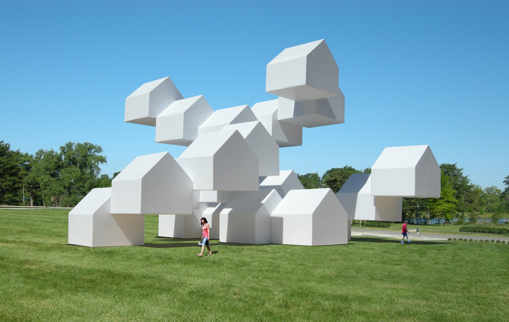
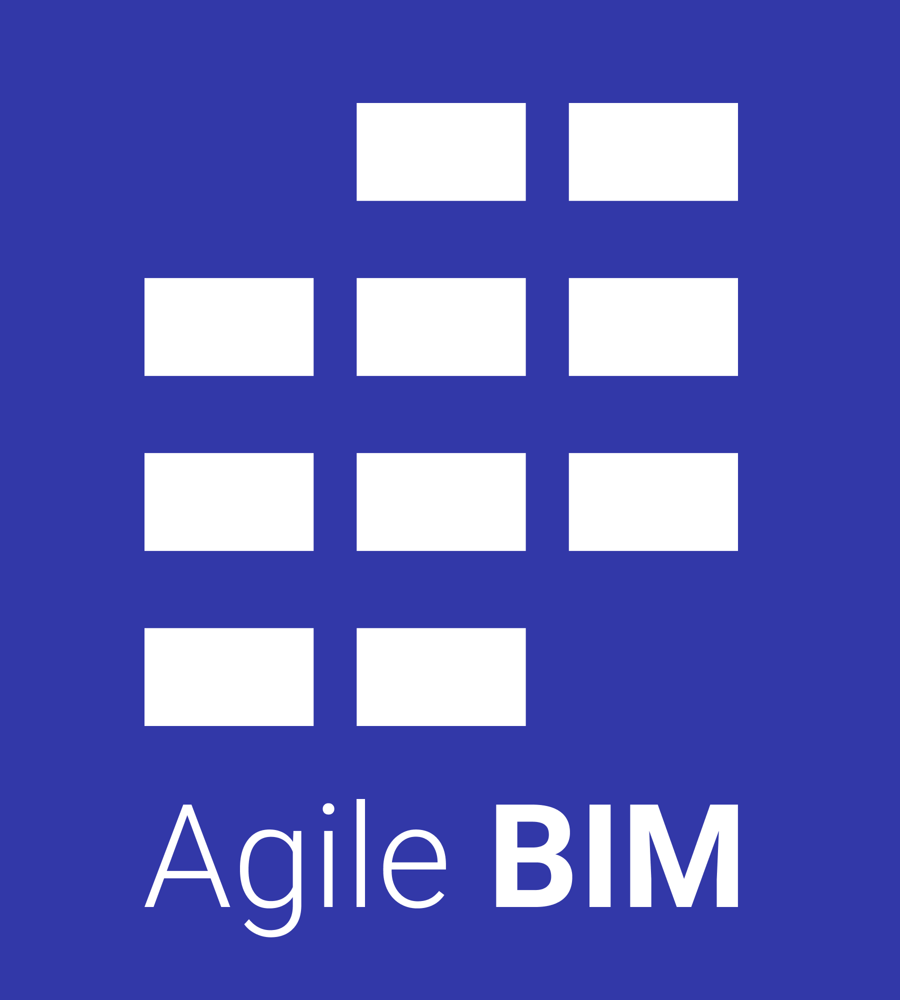

# Agile For AEC

Agile  BIM is a new paradigm inspired by Agile in software industries, Agile in hardware, Scrum, Kanban & Extreme programming methods. 

AEC industry, is well-known to use the old  "waterfall"  method of managing.  The building projects need the coordination of lots of different actors who don't talk enough together and  act one after the other. 

Agile methods in software, industry and services have demonstrated that changing this organization to  highly coordinated agile teams can achieve : 

* more efficiency 
* more motivation in the teams 
* fewer errors and ways to fix them quickly
* a final product more adapted to the market & to the client wish

So let's try to lay down the principles of Agile BIM applied to AEC industry !  

### Let's go : 











### Agile BIM sponsors

Agile BIM is sponsored and by [Bricks, the agile collaboration app for architecture and construction](https://www.bricksapp.io?utm_medium=agileBIM&utm_campaign=page)


[👋](https://emojipedia.org/waving-hand/) Want to help this open innitiative and become an agile BIM sponsor please [contact us](mailto:hello@bricksapp.io?subject=Be%20sponsor%20of%20Agile%20BIM)


