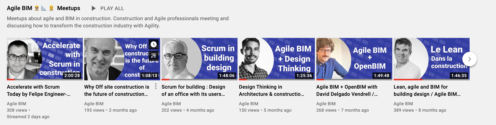

# 🙌 Join Agile BIM

### Links to agile BIM community &#x20;

#### Slack and group

* [Slack](https://communityinviter.com/apps/agile-bim/agile-bim)  to chat with other BIM agilist
* [Group on Linkedin ](https://www.linkedin.com/groups/8584849/)to discuss or promote your agile BIM activity on Linkedin

#### Meetups and Youtube channel

* [Youtube channel ](https://www.youtube.com/channel/UCTjcoh157n3hxKCxpEvfqeQ?sub\_confirmation=1) to watch meetups video and get notified for new videos
* [Meetups page on Linkedin ](https://www.linkedin.com/showcase/agile-bim/) to get informed about our next meetups
* [Meetups page on Meetup.org](https://www.meetup.com/fr-FR/collaborative-architecture)&#x20;

#### Learn and teach / coach Agile BIM

* [Form to join a directory of agile BIM coaches ](https://airtable.com/shrbhMGRK4zRIAQ7Y)willing to accept some missions
* [Form to contact us](https://form.typeform.com/to/Trup49u9) if you want to be coached or learn Agile BIM
* Agile BIM learning by email by Sébastien Lucas
  * In french : [Apprenez l'agile BIM en pratique semaine après semaine](https://form.typeform.com/to/DeVTmH77)
  * In english: [Learn agile BIM in practice, weeks after weeks  ](https://form.typeform.com/to/sUaTNnDw)

### &#x20;Agile BIM meetups

We regularly organize [meetups](../meetups/) and working groups to discuss agility in the field of architecture and construction.&#x20;


[meetups](../meetups/)


### Contribute to AgileBIM.org

Finally, you can contribute to this wiki dedicated to agility in building and construction. To do this, you can modify the content of this [page via Github](https://github.com/sinsunsan/agile-bim-aec) and propose your modifications.\
\


[contribute.md](contribute.md)


