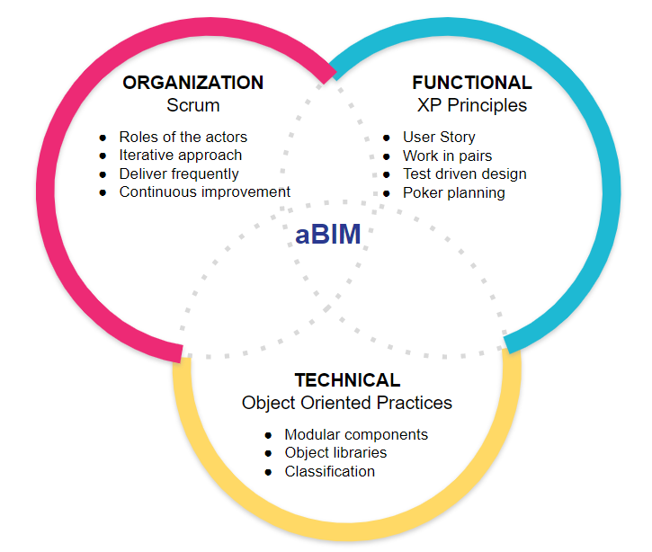

# Agile BIM Method

BIM can become more agile by relying on three pillars: group organization, business practices and technical standards:

Evolving the practices of all the actors involved in a project in each of these three aspects will make it possible to create a virtuous cycle with shorter iterations and better quality and consistency of project design.

