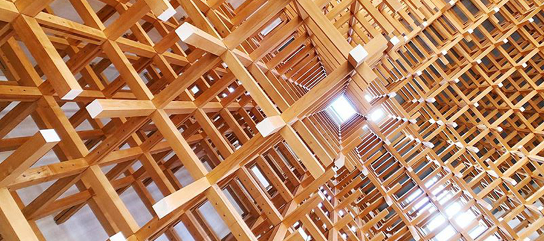
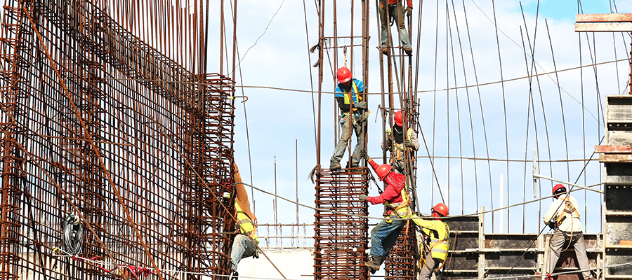

# Un projet de construction Agile

## Phase programmation

* Echanges avec les utilisateurs finaux pour définir les usages
* Définition progressive du programme à l'aide de projets exploratoires
* Convoquer si possible tous les corps d'états lors des réunions de pré-configurations : Maître d'ouvrage, Architectes, Constructeurs, Ingénieurs pour anticiper les problèmes 
* Ne pas forcément boucler un programme ficelé mais accepter de commencer avec une base qui évoluera au fur et à mesure de la conception

**Méthodes agiles** : Design Thinking, Kanban

## Phase conception

* Travailler par itération 
* Faire se rencontrer tous les parties prenantes de la conception 
* S'accorder sur ce les attendus de chaque itérations et obtenir des validations claires 
* Faire une demonstration de la maquette numérique à chaque étape
* Communiquer sur son avancement et idéalement organiser des standups meetings tous les jours ou au minima une fois par semaine
* Utiliser des outils numériques : plateforme d'échange, outil de communication instantanée, de partage de fichiers pour synchroniser les livrables 
* Automatiser les contrôles et permettre à chaque membre de bénéficier du feedback des outils de validation

**Méthodes agiles** : Kanban, Scrum, Scrumban

## Phase chantier

* Avoir une communication journalière sur les itérations entre entreprise sur chantier
* Chercher à optimiser les flux sur le chantier et les dépenses de  matériels
* Limiter les déchets et réutiliser au maximum 
* Faire se rencontrer tous le monde et chercher à trouver des solutions en commun 
* Utiliser des outils de collaborations et de partage pour fluidifier le partage de l'information

**Méthodes agiles** : Lean construction, Kanban

