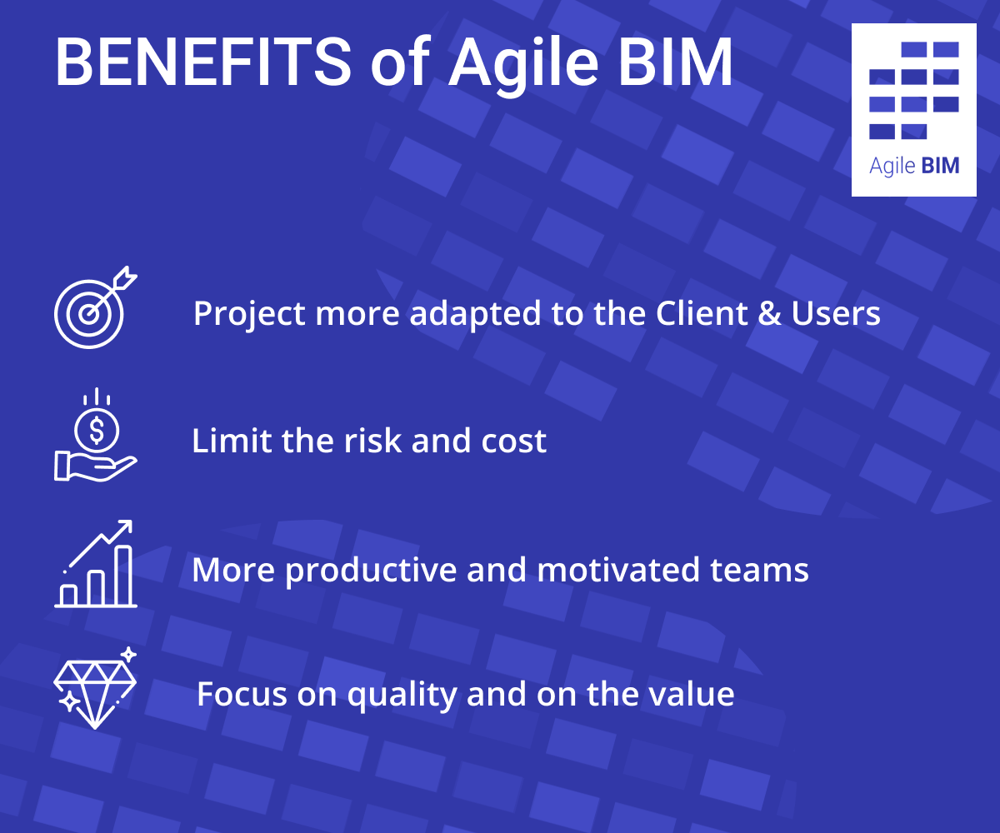

# Agile benefits

Agile approaches are increasingly quoted in the building world. But often without knowing them too much, they are often used as a mantra, or perhaps to refer to a kind of adaptability of the actors!

But by the way, what are the main benefits of the Agile method, especially in the context of architecture and construction?

