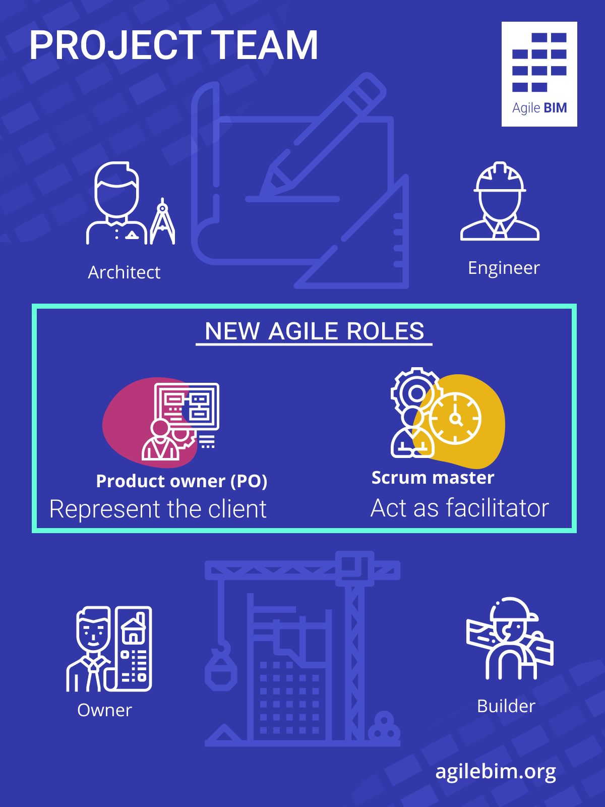

# Team organizations

Agile practices are part of the general organization of actors. Their goal is to fluidify the flow of information between all and to allow overall improvements in architectural design. 

Globally, all good practices coming from agile methods can be transposed as : 

* SCRUM
* Kanban
* SCRUMban
* eXtreme programming

