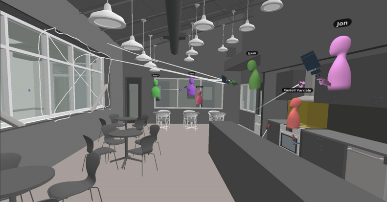

# Demos & Virtual reality

### Why demoing the project to client and users is important

It is a good practice in Agile BIM, to make frequent demo of the project. If you follow scrum framework and work in sprint, the demo is generally at the end of the sprint. 

Demo can be anything that permit communicating about the project current state. With BIM and more generally drawing in 3D, it is possible to be quite realistic and allow every professional in the assistance: architects, engineers, client, or construction company to dive into the project.   

### How to make people have the right expectation of the demo 

But demo purpose is of course NOT to show a final project state. So you should be clear with your public that some element with be sketchy or not well-defined. 

But taking the risk to show the project often, make that all the team is involved in the design process. It follows its advancement and can give early feedbacks. That will save the team precious time and help you refocus or alter the program or architecture solution early.  
  

### Using VR to do an effective demo / users meetings 

  
VR can be a great tool for end users, who are not familiar with readings architecture drawing or even 3D, and can then be immersed in the planned space. They then can give more concrete feedbacks. And help have a direct and more constructive communication between the Architect and the end users who will live or work in his building.

