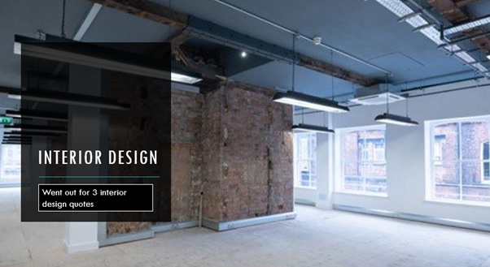

# Scrum for office design /   Hippodigital \(Leeds, UK\)

**Introduction**

Ollio and our uniquely assembled Agile in Buildings team of architecture, digital gamification, theatre production and user stakeholder specialists came together to develop a methodology that enables clients to systematically build better building procurement briefs. Briefs that become the cornerstones of more effective value creation and transformative outcomes for the users of new or refurbished workplace buildings.

Workplace buildings need to be so much more than four walls and a roof.

They should be places that positively and purposefully connect business operation and culture to people and place. Buildings as workplace settings possess the immense and largely untapped potential to support business behaviours in favour of vastly improved business performance and productivity. Yet few of them do. In post pandemic world of work the need for places that support both employees and business is even greater.

Industry studies show failed buildings happen because of poor client briefs where:

* clients spend little time in the creation of them
* write only from a headline strategic corporate or budgetary, rather than operational or in use perspectives
* are largely unappreciated or alive to the needs of business and their users as value creators
* abdicate the responsibility for the generation of them to middle managers, who fail to include wider strategic planning or business purpose in them.

From here, architects and designers are left to conjure a warped version for how the completed building will be used.  Design assumptions are based on initial briefings which turn out to be wide of the mark and often counter-productive.

Only with the immersive top-down and bottom-up collaborative inputs of all users of the building can design brief development begin to capture how a new or upgraded building can be a true advocate for business effectiveness and efficiency that:

·         taps into the deepest recesses of users knowledge as customers

·         has users thoughts and experiences embedded within design team thinking

·         validates design in favour of a more successful business downstream

·         incorporates developments in BIM, 3D Printing, Augmented Reality \(AR\), Virtual Reality \(VR\) and the accompanying revolution in Mixed Reality \(MR\) technologies, all readily available now to modern-day construction customers.

Ollio won a competitive Innovate UK award of £60,000 stg. to undertake a series of rapid project trials within three live case studies with three of our clients now embarking on new workplace/community building projects.

Our three chosen proof-of-concept case projects were:

·         Cemetery Road Baptist Church,- a 10-year masterplan for a community-led campus in Sheffield

·         Kollider Technology Incubation Hub – a new technology start-ups incubation hub at Castle House, Sheffield

·         Hippo Digital’s new offices – a remodelled office fit-out for a leading digital business in Leeds.

Agile Project Management \(APM\) methods grew out of the post-war United States, European and Japanese war rebuilding programmes where automation and efficiency were needed to offset the loss of working-age labour.   Over the next fifty years, Agile Methods \(unfortunate naming terminology sometimes confused with Lean and Kanban or agile office design, which are somewhat different\) was recognised as the solution to solve the inherent inadequacies of conventional Taylorism and Gantt "scientific management" approaches.

Continuing the development of APM into the 1950’s Winston Royston an electrical engineer at IBM coined the term “waterfall”, as an almost derogatory descriptor for Taylorism the anthesis of Agile Methods in project management circles,  where he likened Taylorism to a linear process which fell over weirs or milestones to the next stage.  His criticism being that once the process flow had commenced, it became difficult to halt the momentum generated, and the project went with the flow to completion, with its captured errors as is the case in construction today.

Eric Reis bestselling author of "The Lean Startup" and a proponent of Agile Methods is even more scathing of Waterfall, stating that Taylorism “provides the illusion of certainty”.  Plans require estimations to be right, which is monumentally demanding of large complex projects. For Reis waterfall is characterised by several defects;

•    Scope Bloat.  - Cram in as much as the budget can afford. Aspirations usually exceed budget eventually leading to cost overrun and “de-value engineering”.

•    Blind Investment – cost risk remains and is only mitigated on completion.

•    Architectural Risk - Design risks come to surface too late

•    Functional Risk – Users don’t get to know if it works until the end.

•    Change Risk – Cost risk supersedes change risk, meaning it is never adequately addressed.

•    Uncertain Cost and Duration – Large numbers of change requests are commonplace.

•    Resource levelling/availability – Windows of availability never align. Availability of the right people input at the right time is difficult to align, which reduces quality.

•    Team motivation – When projects go wrong commercially, interest wains, quality declines further, user outcomes drop to the bottom of the priority list.

All the above being factors that affect the production of buildings, and which ultimately lead to uncertainty and user dissatisfaction with the outturn product.  Expanding the work of Royston, statistician, professor, author, lecturer, and management consultant W Edwards Deming.  Edwards Deming  with the experience of several years troubleshooting projects in post second world war Japan, observed that the failure of a project was usually the product of a management process failure, rather than a failure of execution or the competence of the operatives implementing it.   He noted that managers of the failed projects also tended to diagnose the causes of their inability by incorrectly attributing the reasons to technical non-compliance or operative incompetence. In  most cases, Deming concluded, the failure had its origins in the generation, management and care taken over information quality arriving or leaving the design table, and usually had little to do with the execution of the planned procedure at site level. 

Swayed by the work of Royston and Edwards Deming and the need to improve the quality of information on the design table, Jeff Sutherland and Ken Schwaber brought forward thinking on “adaptive” software development.  Followed in the 1990s, to eventually be called Scrum.  Scrum is one of a number of so called "lightweight" APMs, all evolving in reaction to the perceived inadequacies of heavyweight Taylorism methods.

The common thread for the all Agile Methods \(including Scrum which became the predominant of all the above Agile methodologies\) is in integrating feedback from users at the very earliest stages in the design process. This is achieved by incorporation of rapid prototyping, testing and even trial and error early in the design process, as a means of eradicating the risk of failure associated with rejection of the product by users post launch to the market. 

Due to their deeper involvement, users become the custodians of product quality while also sustaining customer change requirements and innovation feedback loops for a de-risked product outcome.  In 2001, frustrated at the slow take up of Agile Methods seventeen software developers all prominent proponents of lightweight project development, met in Utah to discuss how they might promote the apparent benefits of lightweight methods to a broader audience.  To this point, the take-up of the methodologies was confined to a number of the major corporates. In response, Fowler and Highsmith published “The Agile Manifesto”.

At the heart the manifesto are 12 principles \(recommended to be read in full\) which distil into four key themes as follows;

•    Individuals and Interactions over processes and tools - Prioritising the quality of people and face to face collaboration above siloed activity with a prescribed project managed process

•    Working product over comprehensive documentation. -  Concentrate on how the product

should work, and back cast this to the design process, over \(not instead of\) concentrating on producing a competent set of design specifications on time and on programme. 

•    Customer Collaboration over contract negotiation – Manage the quality rather than the cost.

•    Responding to Change over following a plan – Invite change to improve quality, the product is more important than the plan.

The group went on to form the Agile Alliance, to further the development of Agile Methods across industry and to promote adoption and training in its implementation.  In 2011 the Agile Alliance created the Guide to Agile Practices \(renamed the Agile Glossary in \(2016\), an evolving open-source compendium of the working definitions of agile practices, terms, and elements, along with interpretations and experience guidelines from the now global community of agile practitioners.

In recognition of findings of in the software development and technology sectors, it seemed valid to ask if Agile Methods with its clear focus on customer outcomes could be of benefit to the construction industry?  If so, how should Agile be deployed? Are the synergies of the technology industry with that of construction strong enough to affect a successful introduction of Agile Methods, and if so, how might it be achieved?  It was the desire to test Agile Methods in the design of a building that became the primary rationale for our three cases study projects, to test if Agile Methods could be used in the design of the brief for the built environment.

**Agile in Buildings - Scrum for Building Design**

Following the proven successful approaches of APM in the software development industry, the Agile in Buildings \(AnB\) approach has three active stages.

**Stage 1 - User Stories:** invites users at all levels of the business to record and display on Q-cards, issues they feel should be prioritised within the new design, if the building is to demonstrate success.

**Stage 2- Product or Problem Backlog:**  sifts the Stage 1: User Story Q-Cards placing them into overarching themes to arrive at a shorter consolidated and prioritised list of categories or streams that describe the totality of the issues described in the Q-Card User Stories.  This overriding, yet definitive list of problem categories is called the Product or Problem Backlog \(PB\). The listed items are prioritised in favour of highest value and lowest cost at the top, and lowest value and highest cost at the bottom.

**Stage 3 - Scrum.**  Scrum Teams of six people or less user and designers to work through each of the PB items. For each PB items, scrum members are tasked with the creation of a minimum viable prototype \(MVP\) agreed by users to solve their allotted Backlog Problem. The MVP can take on any form. It can be a working Virtual Reality model, a drawing, or a short specification. The only prerequisite is that it should be capable of being tested in use by users. Within the context of this Audience of the Future demonstrator prototypes are immersive VR environments enabling the users to stand in the spaces that they helped co-design, before they are built.

Each scrum team has an assigned Problem Owner who represents the main body of business users.  A Scrum Master guides the process unblocking obstacles to success.

When the Problem Owner in consultation with all scrum team users is content with the solution, he/she will use the developed VR prototype to test the solution with all perspective users of the building. The Scrum team maintains responsibility for time and cost, and it is acceptable for the Problem Owner to say when enough time has been spent in search of a solution, even without having achieved success.

Within the methodology, users frame solutions, participate in their development, and gain the reward of seeing their solutions take shape.  They also gain knowledge through the process, become participants rather than observers, and eventually more informed critics of

The process also has spin-offs in using the property project to harmonise the user community around common goals, thus improving their engagement with the business and leading to a building which informs a better business. Ultimately creating the conditions for the defined “performance sweet spot”.

**Hippo Digital Case Study**

Hippo Digital work in the digital sector to help their clients create applications or products with the right interfaces for their client's customers.  To achieve this HippoDigital need to be able to gain a deep understanding of their client's organisation and work with them to ensure the designed digital services are both usable and operable. They also conduct what are called retrospectives to measure how the released digital applications or services are performing, against both your users and your organisation's objectives. They use Agile Methods of design and product management to do this.  Given that already use "scrum" in their business process, they were keen to have our team try it out to help resolve the critical problems they were having with their own office HQ in Leeds.

Hippodigital  moved into its new permanent home at Aireside House in April 2018. They needed a place to accommodate the rapidly increasing business.  The Directors of the business saw the location of Aireside House as its main advantage. The new office was situated between their main client's offices in Leeds and the central rail station.  The hope was they the office would be welcoming enough to have their clients drop-in as they passed by.

When they first viewed the office before agreeing the lease it was in a "shell" state.  They went out to three interior designers to ask for sample designs and quotations for the interior design and fit-out.  Mostly on the basis of a spoken brief, the three design firms came up with a similar floorplate arrangement.  Each proposed a kitchen/meet and greet area near the reception;  a central admin space with desks for office based staff, and a large workspace for charrettes  and touch down at the back of the office furthest away from the reception.

The designs looked great on paper. They pressed ahead with the one they preferred best.

Then, six months after moving in, things were not good. The office space just did not work. The admin team complained that there was just no privacy in the office. The external user experience \(UX\) teams, who mainly worked away from the office with clients, avoided coming into the office, preferring to work at home or in client's offices.  This meant team cohesion and business governance was being compromised.  Admin teams complained of being disturbed as guests walk through from the kitchen space through to the rear workspace.  It all meant that confidentiality was being compromised.  There were not enough meeting rooms, nowhere to make a private phone call, no places to have a quiet word with a colleague. The design of the office simply wasn't working.

We started our **Agile in Buildings** exercise with an "All our Ideas" survey.  All our Ideas was developed in Princeton University with Google using, the same Google search engine algorithms to allow users to suggest things that might help to make the offer office better and then using the Google algorithm prioritise him.  Using the technique allowed us some insight into the things users really wanted to change in the office and which things were not so important. The All our ideas survey went out to staff two weeks before we met them for our first Agile in Buildings Users Stories Charrette.

In the charrette we ran it like a traditional agile methods process.  We gave uses cue cards to put down who they were what they wanted and why. After 30 mins they generated 250 cards. Collecting all the cue cards together and sifting them, themes start to emerge.  The themes were collecting around five or six core ideas or problems.

Top of the list was what the theme we called **"Space and spaces"**. We saw lots of staff complain about the type of space that they worked in. They did not like where the admin space was they didn't have enough meeting space. They were unhappy with the level of confidentiality.  They needed space that would encourage remote researchers to come into the office more often so they could have those serendypitous exchanges with them.

The list went on to include **desks and furniture** they wanted better desks they wanted to be able to touchdown quickly plug  quickly. They was a theme around the **visitor first impression.**  They wanted **access to the office** on a 24/7 basis. They really needed **better technology** another theme started to emerge like **health and well being** and biophilia.

This was all great information to architect John Orrell of DLA Architecture. Embracing this collection of data he was able to sit with the users and begin to sketch out a plan that might work a little better.  He had a heartspace at the centre where  touchdown desk could be located. He proposed to switch where the admin was now and swap that over with way to workspace was now so admin didn't get disturbed by visitors coming into the office. He created some meeting spaces.  He devised route through the office for guests  and routes for staff thus managing visitors in a better way.

With everyone agreed on the 2D concepts,  John and his team went away and worked the plans up into 3D BIM model. Then in Enscape technicians quickly rendered the model interiors before to converting them into augmented reality versions of those 3D models

Ten days later we were back for the next charrette. When users were conducted around the 3D model on a flat screen there was some feedback.  Things they liked, mainly most things they liked.  But then, when the moment came for them to try on the VR headset and became fully immersed in the model -  then real feedback came through.  Walking thorough the model as if it was real the feedback was granular.  "Can we have a kitchen table?" We don't breakfast bar design will work"  "We would much rather sit around a table and have lunch together rather than be on high seats."  This was the granularity of the feedback we were getting.  This was the users starting to be really invested in what this design was, and what it could be.  The end result was something that the whole team had a common understanding off. This extra 10% is what made an already great design, owned.  It's a solution they can't wait to move into for real.

**Scrum Retrospective**

The Hippodigital **Agile in Buildings** Case Study followed a different process to the Case Study 1 and Case Study 2

In this case study we had a client who understood Agile, whose business model was an Agile one..

However, once again the process and the Agile in Buildings team proved equal to the challenges Hippodigital posed. Agile in Buildings was created to offer this degree of agility in design, to be able to respond to and even invite change from clients.  The solution was exactly what users wanted.  The project has not been completed on site yet Covid lockdowns has delayed things a little.  But it's expected to be complete and ready for a visit towards the end of the Spring  2021.  In which case we'll take some photographs and post them online.  We will also get some feedback from the users to see if what they designed in cohort with our designers is really as good as they expected it would be.

In all case studies, we were pleased that the creation of models and generation of VR content could be done as quickly as it needed to be to keep the whole process moving.  We were happy we had created a genuine agile scrum process. We were getting things done and turning around solutions fast. 

The process commenced on 21 May, was complete less than 7 weeks later.  To have this level of data on the design table this quickly is unknown to the vast majority building design projects.  We set the detail design and construction phases up to move at pace and with accuracy.  Risks of building the wrong thing right the way down to granular detail of interest to the user were obliterated.

However, in review we agreed there was still an absence of cost data to inform the decision-making process. Cost data is of primary concern to project funders, and if there is a lesson to be learned is to understand how this can be better handled in other industries where Agile Methods and Scrum are deployed.

Another lesson we learned was to make sure that the product owner the client representative is stronger in the Scrum process. In our "proof of concept" case studies the aim was to make sure that technology worked and the scrum master position was one that was accommodated. That said, we took our eye off the ball slightly in making sure that that important position of product owner what is good as it needed to be. 

That said, the process was beautifully elegant in its operation. It weeded out and solved so many problems for our clients. Everyone who participated in it loved it. It really was fun. It brought the client team and design teams closer to each other.

For our industry Agile creates the headroom that we are going to need to solve the big problems for our industry.  We need to embrace sustainability, health and well, additional safety and legislation in a time when most contractors are barely profitable.  Added to this being recovery and resistance to a pandemic's adds to the financial challenges that we will need to get to grips with. We will need a stronger more agile industry to do it.

How can we expect to make things better when its the very way we are doing things that is the cause of our problems? We need to change not what we do but how we think.

Agile is that change in thinking.  Thank you. 

Check out our Hippodigital solutions for yourself. Use your phone to scan the QR codes below \(you may need to enlarge them by clicking the image first before scanning with your phone\).

