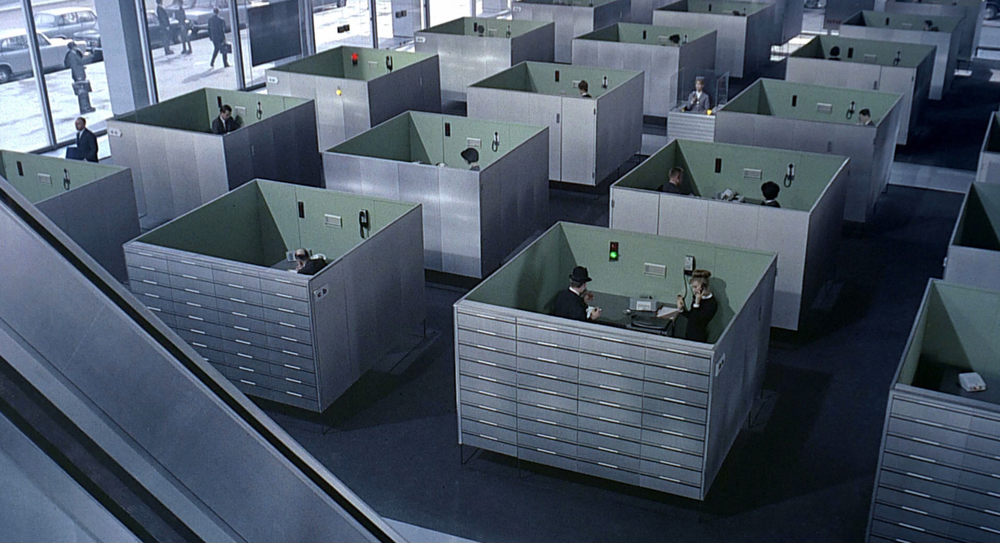

# Problèmes de l'approche traditionnelle

### Les problèmes de la méthode de gestion de projet traditionnelle 

* Les acteurs interviennent en décalés et trop tardivement
* Il y a trop de travail inutile
* Les acteurs communiquent difficilement
* Il y a trop de problèmes de coordinations, qui ont un coût sur le chantier
* On ne sait pas qui fait quoi 
* ....

D'autres problèmes ? [Contribuer à cette liste](../communaute-agile-bim/contribuer.md) !

