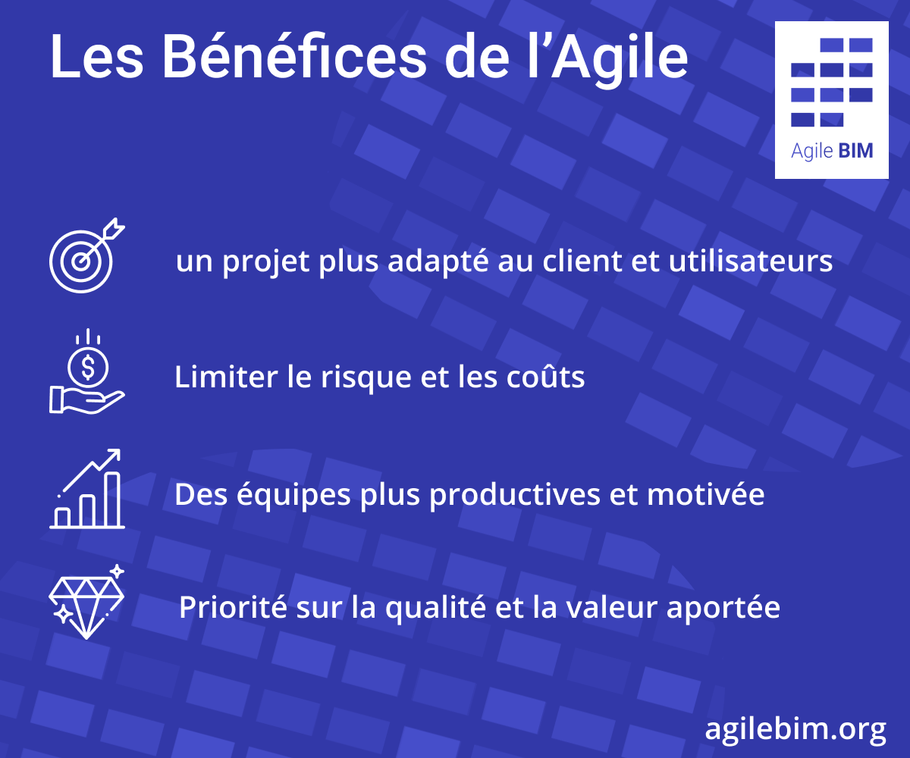

# 🎯 Bénéfice de l'Agile

Les approches Agiles sont de plus en plus citées dans le monde du bâtiment. Mais souvent sans trop les connaître un peu comme un mantra, ou peut être pour se référer à une sorte d'adaptabilité des acteurs !   
  
Mais au fait quels sont les principaux bénéfices de la méthode Agile et notamment dans le contexte de l'architecture et de la construction.  

