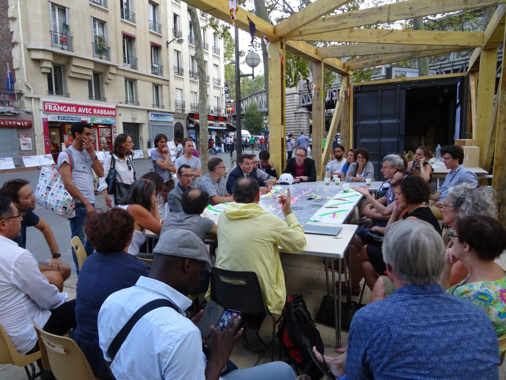
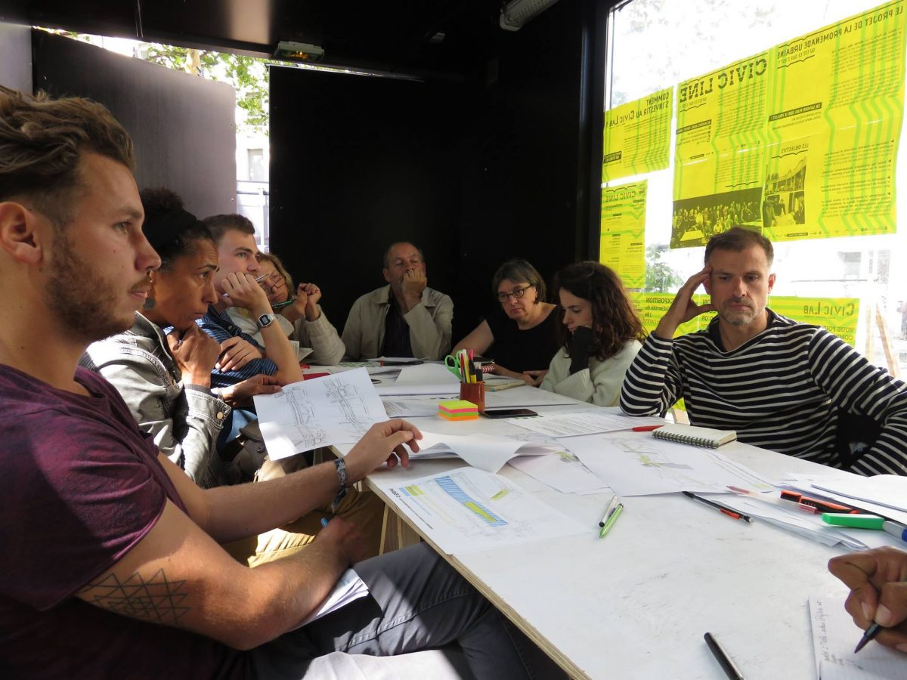

# Les retours de l'utilisateur

### Faire participer les habitants, une pratique qui se développe

En architecture il est rare d'avoir le retour direct de l'utilisateur final. Par exemple dans le cas d'un logement, des personnes qui vont habiter ce logement. 

Ceci pour plusieurs raisons : 

* l'utilisateur n'est souvent pas connu au moment de la conception 
* le maître d'ouvrage sert souvent d'intermédiaire et il a consulté ses utilisateurs en amont

Néanmoins cela tend à changer, notamment : 

* grâce aux **outils de communication numériques** qui permettent d'interroger les utilisateurs pour un coût bien moindre, sans forcément organiser des ateliers
* comme dans d'autres domaines, le **participatif a le vent en pompe** et donc des ateliers sont organisés plus en amont
* les **réseaux sociaux** permettent d'amplifier des démarches et de communiquer plus en temps réel sur le projet

Les démarches d'informer mais aussi de faire participer les utilisateurs finaux sont plus répondues en urbanisme notamment, lors de la conception d'un quartier entier. Les "utilisateurs" qui sont donc les habitants du quartier sont d'ailleurs à plus d'un titre les **experts de leur quartier**. Ils en connaissent les problèmes, les qualités. Il faut alors trouver un point de rencontre entre le projet proposé par l'équipe de conception et les attentes des habitants. 

Cette démarche a de nombreux atouts : 

* Crowdsourcer une connaissance du quartier qui seraient difficile d'obtenir autrement 
* Étudier le projet depuis des points de vue très différents donc l'enrichir
* Faire participer les habitants donc les faire s'impliquer et accepter positivement le projet 
* Mettre à l'épreuve  des hypothèses de projet au-delà de l'équipe de conception 
* ....

### Le développement de l'architecture collaborative

Certaines agences se sont fait la spécialité de travailler de manière collaborative avec les habitants. On peut citer par exemple l'**atelier d'architecture autogérée** qui présentent sur son [site](http://www.urbantactics.org/projets/civic-lab/) plusieurs projets appliquant la démarche collaborative. 

