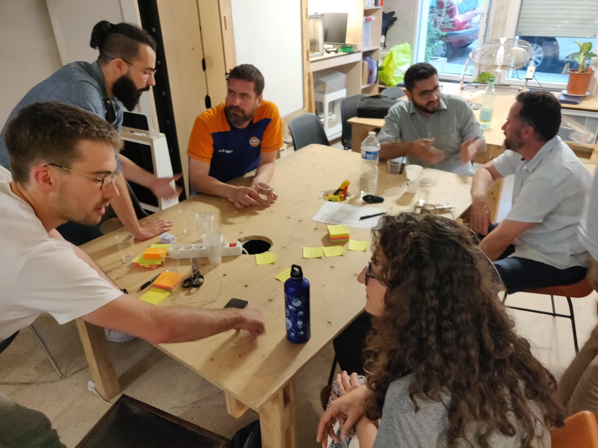

# Rejoindre la communauté

Participer aux échanges :

* [Groupe Linkedin](https://www.linkedin.com/groups/8584849/)
* [Slack](https://communityinviter.com/apps/agile-bim/agile-bim) 
* [Groupe sur meetup](https://www.meetup.com/fr-FR/collaborative-architecture/)

Nous organisons régulièrement des [meetups](https://www.meetup.com/fr-FR/collaborative-architecture/) et des groupes de travail pour discuter de l'agilité dans l'architecture et la construction. 

Il existe également un [groupe Linkedin Agile4bim](https://www.linkedin.com/groups/8584849/) pour échanger des liens, des études de cas, discuter des méthodes agiles et des rencontres de la communauté.

Enfin vous pouvez contribuer à ce wiki dédié à l'agilité dans le bâtiment et la construction. Pour en savoir plus, cliquer sur le lien suivant.



Nous avons également un [slack](http://bit.ly/agilebimslack) que vous pouvez rejoindre pour discuter au quotidien de l'organisation des meetups, de vos cas pratiques, de l'agile BIM en général.

