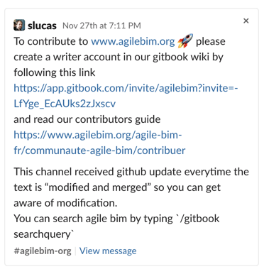

# 🖋️ Contribuer à AgileBIM.org

Si vous êtes intéressé par l'agilité appliquée à l'architecture et à la construction. N'hésitez pas à contribuer à ce wiki ! 

**Comment  contribuer ?** 

*  Rejoignez notre [slack](https://communityinviter.com/apps/agile-bim/agile-bim) et la chaîne **contribute-to-agilebim-org**
* J'ai partagé un lien pour devenir éditeur du wiki
* Devenez éditeur du WIKI sur [gitbook](https://app.gitbook.com/invite/agilebim?invite=-LfYge_EcAUks2zJxscv) Vous pourrez alors modifier ce site de manière très simple. 

### Gestion des langues

Le wiki est pour l'instant en 2 langues : Français et en Anglais. Vous pouvez contribuer à l'une comme à l'autre. Idéalement l'arborescence des langues se reflètent et les articles sont traduits dans les deux langues. Mais cette traduction n'est pas forcément faite par vous, si vous ne maitriser pas l'autre langue.

### Appel à contribution

Vous pouvez contribuer de beaucoup de manières, en écrivant un nouvel article, précisant un article déjà écrit ou même corrigeant des fautes d'orthographe ou des imprécisions. 

Nous recherchons plus particulièrement des contributeurs sur les parties suivantes : 

* **Boîte à outil Agile :** sortes de  fiches pratiques sur les pratiques agiles applicables dans la construction



* **Retours d'expérience** : des cas concrets de l'utilisation des méthodes Agile sur des projets d'architecture et de construction



### Licence Creative commons / Publication Open source

Tous les contenus publié sous licence creative commons et disponible également sur [github](https://github.com/sinsunsan/agile-bim-aec).

Pour en savoir plus sur la licence, cliquer sur le lien suivant.



