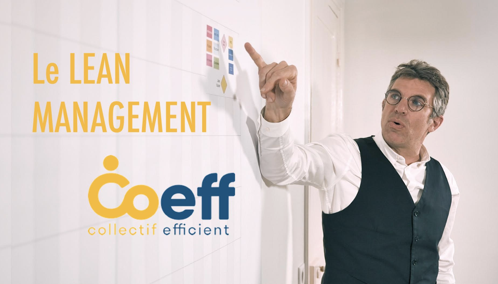
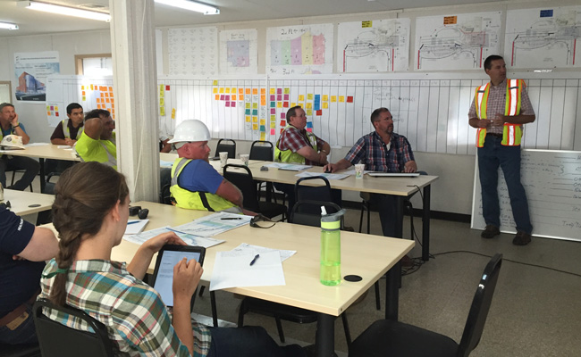

# 6 / Agile + LEAN

### La page du meetup sur notre groupe Architecture collaborative



### L'invité du jour : Vincent Morael / Le Lean Construction

#### 👉 Vincent Morael : Spécialiste du LEAN dans la construction

« Le LEAN MANAGEMENT est une approche systémique et collaborative de la gestion de projet permettant, en le combinant avec des méthodes AGILES, de concevoir et de développer des projets plus rapidement, plus sereinement, d’être plus performant économiquement et de proposer aux clients la meilleure réponse qualité cout délai adapté à ses besoins  
  
Nous vous présenterons les fondements et la mise en place de cette méthode de management de projet en phase Programmation et Étude d’un projet »  
  
Pour en savoir plus [www.coeff.fr](http://www.coeff.fr/)

### 📽️ La vidéo 

A venir...sur notre [chaîne you tube](https://www.youtube.com/channel/UCTjcoh157n3hxKCxpEvfqeQ)

### 🖼️ Les slides 



### 👷‍♀️ Les 20 participants 🙍🙎‍♂️

#### Les organisateurs

* François Muzard
* Billel Zedazi
* Sébastien Lucas

#### Le présentateur

* Vincent Morael 

#### Le public

* Anthony Carta 
* Aurélie Maury
* Bédis Damergi
* David Ravigneaux
* J.L. Romano
* Laurent Coydon
* Marie Baal 
* Marie Rouleau
* Marie-Christine Duong
* Mourad Bencheikh
* O.L. Ely
* Olivier Farlotti
* Victoire Schellenberg
* Inventive.city
* Bob Eponge
* Daibis Rachid
* Dorothée Citerne

### ☝️ La discussion  

#### Est-ce que Lean peut se décomposer en méthode / pratiques comme l'Agile ?

Oui,  il y a au moins une vingtaine d'outil, qui peuvent être utilisé : 

* le rapport A3
* le last planner système
* ....

Mais le LEAN ne fonctionne que si le client est partie prenante. 

#### Le BIM  et le LEAN

Le BIM permet de synthétiser tous le projet, et de définir des process.

C'est un outil de conception itérative également

Mais au début il faut être clair sur pourquoi on va avoir besoin du BIM. 

Le management visuel est un point commun entre le BIM et le LEAN. 

Mais c'est également un outil de collaboration, qui permet de faire contribuer plus en amont chaque membre de l'équipe.

#### Snohetta et le LEAN

Snohetta a utilisé une méthode itérative 



#### La conception itérative

Le lean peut se combiner avec l'agile. L'agilité permet de régler les sprints, et le lean permet de fixer un retro-planning pour le client. [Last planner system ](https://www.oedo-conseil.fr/qu-est-ce-que-le-lps-last-planner-system/)est vraiment un outil de base du lean. Chaque semaine on fait le point sur ce qui est fait, à faire.... 


Si les équipes refusent d'être dans cette dynamique, elle ne vont pas jouer le jeu.


### Le frame work  safe se dit agile + lean

Il y a très peu de chose qui s'oppose entre les pratiques LEAN et l'AGILE. 

Par exemple l'amélioration continue est à la base du Lean et de l'Agile. le scrum est plus précis sur ce point en fixant quand on se rencontre. 

Toutes les équipes agile utilisent un tableau Kanban.

Beaucoup de choses se retrouvent entre le bâtiment et l'IT.  Mais aussi des différences. Comme on peut le voir dans cette [page](../pourquoi-agile/difference-it-construction-agile.md).

### Un sprint par phase ?

Une réunion en chaque début de phase pour mettre tous le monde d'accord sur les objectifs, sur le planning de rendu, avec des engagements communs. 

Il faut une liste des livrables qui permet à chacun de savoir ce qu'il doit faire.

Est-ce que c'est contradictoire avec la méthode agile ? 

En IT ou peut faire varier les fonctionnalités pour garder la qualité, mais est ce possible en bâtiment ? 

### [ 🔗](https://emojipedia.org/link/) Des liens pour aller plus loin 

* [https://www.associationleanconstruction.fr](https://www.associationleanconstruction.fr/#)
* [ https://www.leanconstruction.org](%20https://www.leanconstruction.org/)

