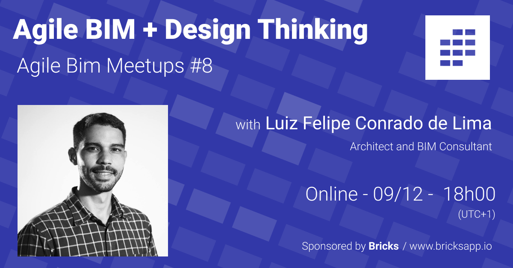

# 8/ Architecture & Design thinking

This week at the Agile BIM meetup we will talk about Design Thinking in the context of architecture & construction projects.  
  
Luiz Felipe Conrado de Lima, a Brazilian architect & BIM and project manager will present us his experience in the field.   
  
Don't miss it!

✨ Design thinking is a method to ideate a project in a short timeframe, choose an idea to develop, prototype and then test the idea with the stakeholders. Design thinking emphasize the need to work with a small team with different complementary backgrounds : architect, engineer, ... **** and who work intensively for a short period of time. 📐💼 [👷‍♀️](https://emojipedia.org/woman-construction-worker/)  
  
We think it could be a great way to handle Architecture design in a more collaborative way. And test ideally quickly at the early stage of the project but involving all the team and not only the architect.

👉 LinkedIn Event page [https://www.linkedin.com/events/6732032311832969216/](https://www.linkedin.com/events/6732032311832969216/)

👉 Meetup Event page [https://www.meetup.com/fr-FR/collaborative-architecture/events/274499170/](https://www.meetup.com/fr-FR/collaborative-architecture/events/274499170/)

👉 Luiz LinkedIn profile [https://www.linkedin.com/in/luizflimarq](https://www.linkedin.com/in/luizflimarq/)  

### 📽️ The video on Youtube 

Coming soon ! 


Don't miss an Agile meetup

👉 subscribe to our [Youtube page ](https://www.youtube.com/channel/UCTjcoh157n3hxKCxpEvfqeQ)  
👉 Join our [linkedin page](https://www.linkedin.com/events/6732032311832969216/)  
👉 Join our [meetup group](https://www.meetup.com/fr-FR/collaborative-architecture)  


### 🖼️ The slides 

Coming soon ! 

### 

This meetup is sponsored  by Bricks, [the agile collaboration app for architecture and construction](https://www.bricksapp.io?utm_medium=agileBIM&utm_campaign=page)

