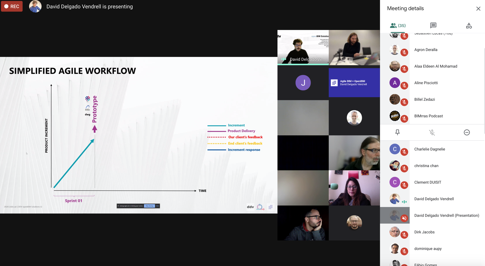

# 7/ Agile + openBIM

👉 LinkedIn Event page [https://www.linkedin.com/events/6724791659042799616/](https://www.linkedin.com/events/6724791659042799616/)

👉 Meetup Event page [https://www.meetup.com/fr-FR/collaborative-architecture/events/273795376/](https://www.meetup.com/fr-FR/collaborative-architecture/events/273795376/)

### 🖼️ The slides 



### 🖼️  Meetup screenshots 

