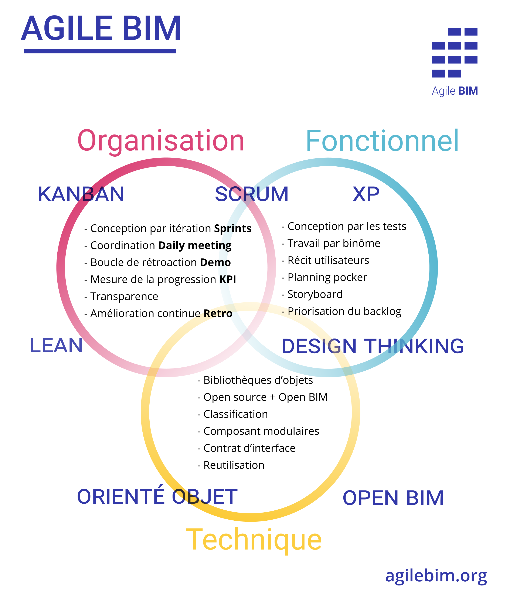

# 🚀 Les pratiques Agile BIM

Agile BIM est un cadre méthodologique \(framework\) constitué d'un certain nombre de bonnes pratiques qui utilisées ensemble vont générer une valeur supérieure globale à la valeur des éléments prit individuellement ou à leur absence et l'utilisation de méthode traditionnelle \("comme d'habitude"\).

Les pratiques d'Agile BIM ne sont pas toutes obligatoires pour commencer a générer de la valeur. Chacune va générer de la valeur en répondant à un ou des problèmes précis. 

Le BIM peut devenir plus agile en s’appuyant sur trois piliers : l’organisation du groupe, les pratiques métiers et les standards techniques :

Faire évoluer les pratiques de tous les acteurs d’un projet dans chacun de ces trois aspects va permettre de créer un cycle vertueux avec des itérations plus courtes et une meilleure qualité et cohérence de la conception du projet en BIM.

[Vous pouvez améliorer cet article ! ](../communaute-agile-bim/contribuer.md)

