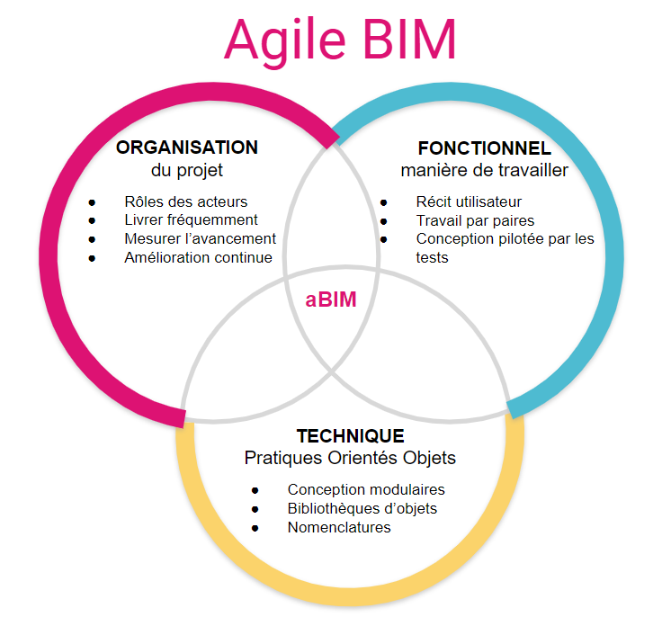

# 🚀 La méthode Agile BIM

Le BIM peut devenir plus agile en s’appuyant sur trois piliers : l’organisation du groupe, les pratiques métiers et les standards techniques :

Faire évoluer les pratiques de tous les acteurs d’un projet dans chacun de ces trois aspects va permettre de créer un cycle vertueux avec des itérations plus courtes et une meilleure qualité et cohérence de la conception du projet.

