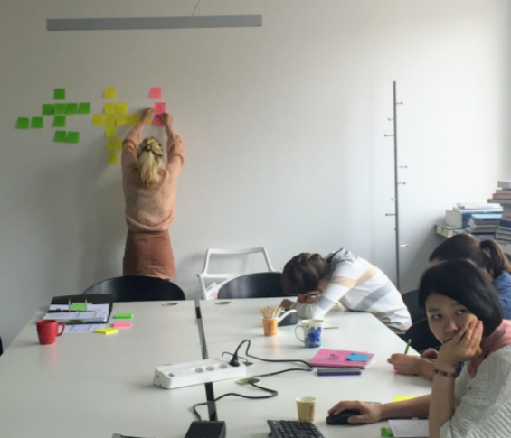
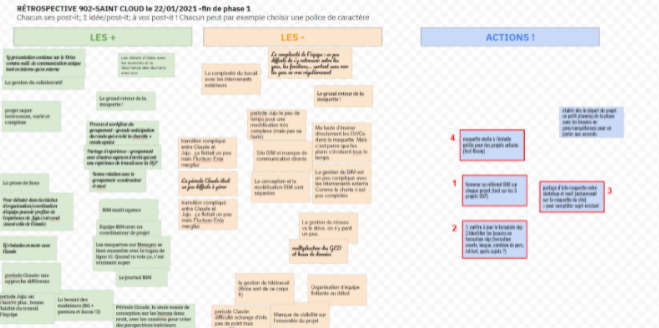

# Les rétrospectives

La rétrospective est probablement la plus importante et la première des pratiques à mettre en œuvre avec votre équipe de projet. C'est un bon moyen pour commencer à changer les choses avec votre équipe, car elle est simple à mettre en œuvre, implique directement les personnes de l'équipe et vous entraîne à animer des réunions "différentes".

## Déroulé

La rétrospective est une réunion ou se retrouve des personnes ayant travaillés ensemble sur le même projet pendant une période donnée \(l'équipe interne, l'équipe de MOE ou de l'entreprise, l'équipe de la synthèse, ...\). En général à la fin d'une phase \(2, 3 mois maximum\) ou plus régulièrement si besoin.

L'objectif ? Mettre en valeur ce qui fonctionne bien \(et célébrer les réussites !\), réfléchir à ce qui pourrait fonctionner mieux \(qualité, efficacité\) et faire des propositions concrètes qui auront l’adhésion de tous.

Les sujets abordés concernent les individus, les interactions, les processus, les outils et logiciels. L'équipe identifie les sujets puis explore des solutions pour les résoudre. Cette réunion ne doit pas durer plus que 3 h voir 2 h.

À la fin de la rétrospective, l'équipe doit choisir des améliorations concrète en favorisant celles ayant le plus d'impact. Un plan d'action précis est décidé par l'équipe pour s'assurer de leur mise en œuvre.

Exemples : 

* “Créer une solution pour tester la qualité de la maquette Revit”
* "Modification des jours de partage des maquettes numériques selon les intervenants".

Elle est animée par le BIM manager ou au besoin une personne extérieure au projet pour que chacun puisse s'exprimer.

Cette réunion est aussi l'occasion de renforcer la culture d'équipe ou de l’entreprise, partager des expériences et motiver les personnes qui peuvent s'exprimer et contribuer à l’amélioration de leur travail. Au besoin certains sujets devront faire l'objet d'une escalade dans l’entreprise pour suggérer des changements plus profonds qui pourraient être bénéfiques à toute l'entreprise.

La principale difficulté sera d'assurer que ces réunions aient bien lieu avant que l'équipe ne remette le nez dans le guidon ou parte sur d'autres projets. Au passage ces réunions peuvent être l'occasion d'élargir les sujets au-delà du BIM pour améliorer tous les processus des équipes ou des entreprises.

## Convention BIM

Exemple de chapitre à insérer dans la liste des réunions prévues.

> Réunion de fin de phase \(rétrospective\)
>
> Après la fin de chaque phase une réunion de rétrospective sera organisée pour :
>
> * Retour par le BIM management et les équipes sur l’ensemble des maquettes numériques livrées, réussites et points à améliorer ;
> * Retour par le BIM management et les équipes sur le déroulement de la démarche collaborative réussites et points à améliorer ;
> * Présentation de visuel \(images, vidéo, visite virtuelle\) présentant l’état du projet BIM à cette phase.
>
> A la suite de cette réunion, un compte rendu est publié qui rappelle le bilan BIM de la phase écoulé et les mesures décidées par les acteurs pour s’améliorer dans la phase suivante.


[Vous pouvez améliorer cet article ! ](../../communaute-agile-bim/contribuer.md)


