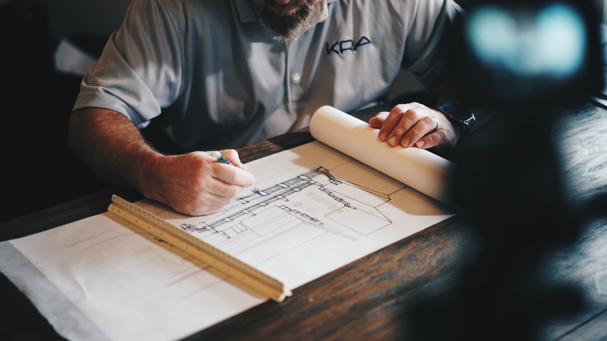

# Différence entre l'IT et la construction

[Vous pouvez contribuer ! ](../communaute-agile-bim/contribuer.md)

### Ce qui est pareil ou similaire

* La mélange de professionnels techniques \(les ingénieurs\) et créatifs \(les architectes\) et un client \(le maître d'ouvrage\)
* Un format d'échange le code pour le développement, une maquette BIM pour le bâtiment

### Ce qui est différent

* Le bâtiment c'est du dur : difficile de démolir ce qui est fait en supprimer des fichiers
* Les membres de l'équipes ne sont pas une seule société et ne partagent pas les même locaux 
* La possibilité de varier les fonctionnalités pour le MVP, la première version du logiciel est partiellement faisable en bâtiment. 

