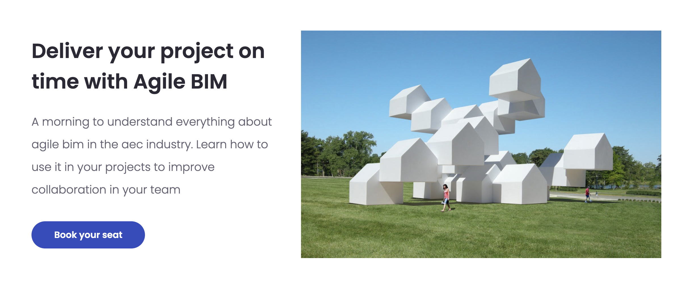

# 🎓 Learn AGILE BIM

### Learn by yourself and with the community

You can subscribe to this **free training** by Sébastien Lucas to get step by step guide to start&#x20;

**In english**&#x20;



**In French**&#x20;



You can look at our meetup in our Youtube channel&#x20;



### Join one of our [master class ](https://learn.agilebim.org/en)

To be introduced to agility in the fields of cosntruction and join our community of students.

[Master class Agile BIM en Français](https://learn.agilebim.org/)

.png>)

[Agile BIM master class in english](https://learn.agilebim.org/en)

****

****

****

### Find an agile coach specialized in AEC



### Agile for architecture & construction training programme





