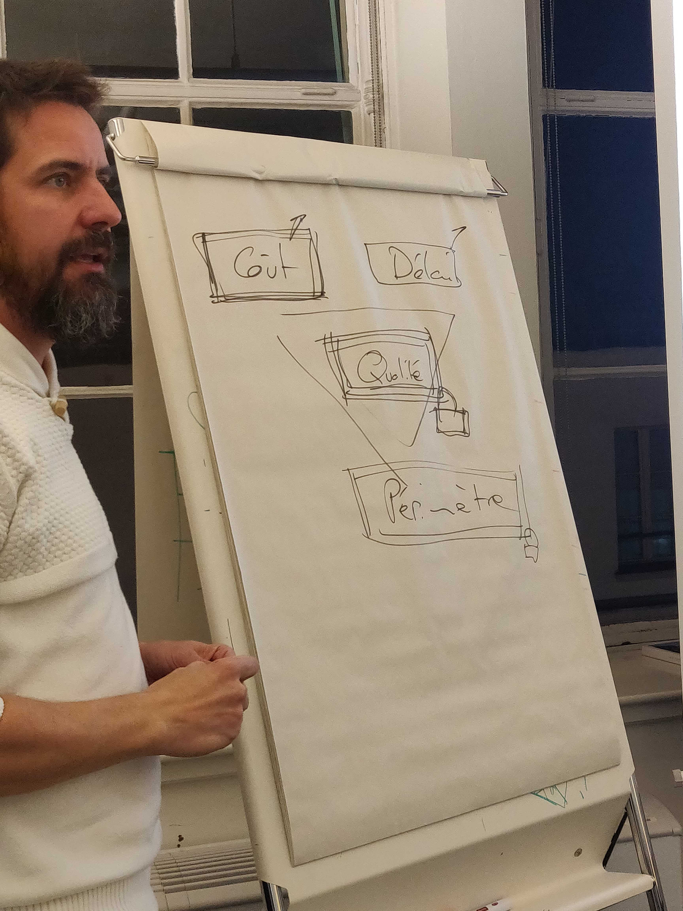
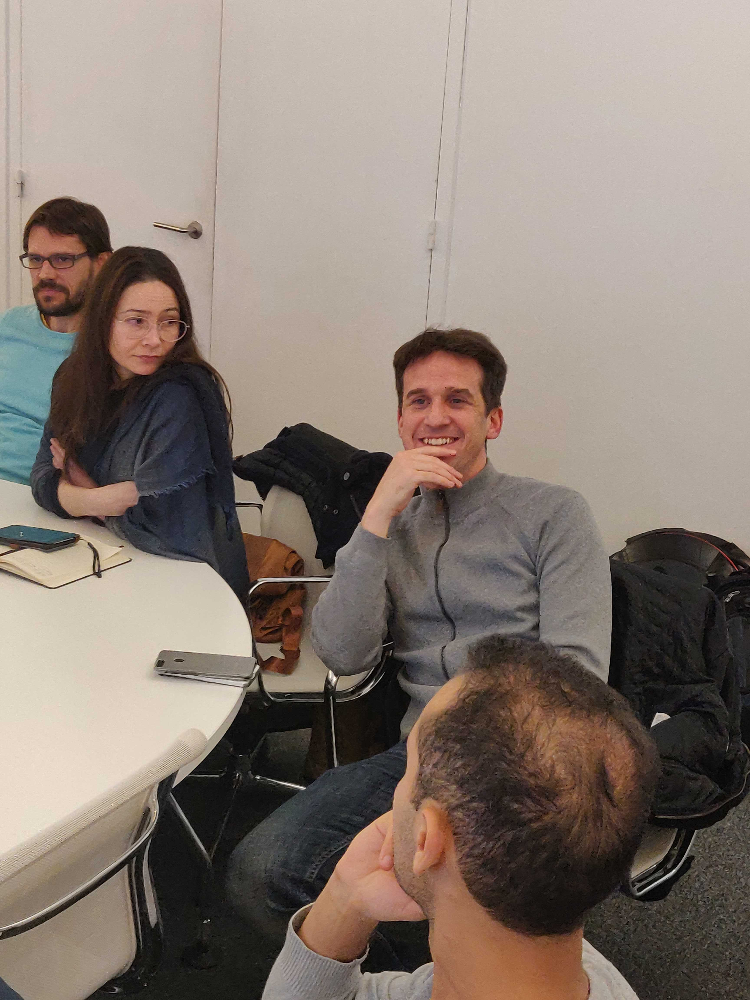
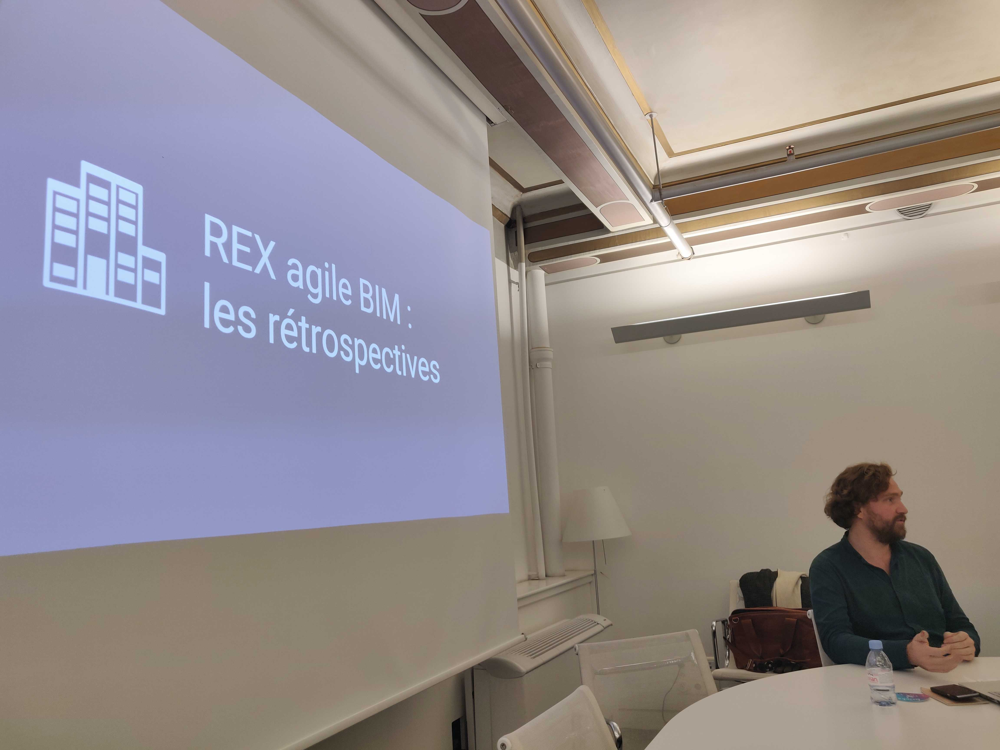

# Pratiques agile dans le bâtiment #4



### La video


Meetup Agile BIM chez Valode et Pistre / 9/12/2019


### Les participants 👷‍♀️🙍🙎‍♂️

Les avis des participants (ROTI) [https://roti.express/share-survey/5AMA3NfySPq8NzgFN](https://roti.express/share-survey/5AMA3NfySPq8NzgFN)

Le meetup s'est déroulé avec 12 personnes représentant différents domaines :



* Coach agile, Scrum master, PO...
* Architecte, BIM manager...

**Merci  à tous :**&#x20;

* [Anna-Lisa de Maestri](https://www.linkedin.com/in/annalisademaestri/) ([Valode et Pistre](http://www.v-p.com/en))
* [Sébastien Lucas](https://www.linkedin.com/in/archiref/) ([Bricks](https://www.bricksapp.io/fr/))
* [François Muzard](https://www.linkedin.com/in/fran%C3%A7ois-muzard-bim/) ([Bricks](https://www.bricksapp.io/fr/))&#x20;
* [Laurent Coydon](https://www.linkedin.com/in/lcoydon/) / Coach Agile
* [América Bañuelos](https://www.linkedin.com/in/americabanuelos/) / Architecte
* [Olivier Rouhaud](https://www.linkedin.com/in/olivier-rouhaud-562b745b/) ([Blog](https://olivierrouhaud.wordpress.com/)) / Coach Agile
* Pour ceux qui ne sont pas dans la liste vous pouvez [rajouter votre nom](../fr/communaute-agile-bim/) en rejoignant le slack en devenant éditeur de ce wiki :)&#x20;

### Les slides 🖼️&#x20;



**Première présentation  de  François et Laurent sur les méthodes de collaboration dans la construction.**

### **Le débat** ☝️

Puis débat animé par les Coachs agile de l'assistance.

On peut se dire Agile et ne pas l'être, et également d'être  collaboratif et agile, mais ne pas utiliser de framework.&#x20;

**Est-ce  qu'il y a une taille idéale pour une équipe agile  ?**

D'après Scrum une petite dizaine.

**Est-ce que le client  compte  dans l'équipe ?** \
****\
****Il y a le PO (Product Owner) qui représente le client en Scrum.

Ce qui est très important est de privilégier la relation que le contractuel. La négociation contractuelle doit changer pour changer la relation de confiance.&#x20;

Une possibilité est de payer les intervenants en fonction de la valeur produite.

L'agile change la manière de raisonner :&#x20;

**La méthode traditionnelle** : Le périmètre (le programme) ne bouge page / Le coût, délai augmente et du coup la qualité diminue.

**La méthode agile** : le périmètre est négociable / ce qui n'est pas **négociable est la qualité**.

Mais donc un gros frein est la contractualisation surtout dans le public.&#x20;

Aussi une différence importante entre le logiciel et le bâtiment, est la notion de devoir terminer le bâtiment à tout prix, ce qui n'est pas toujours le cas dans un logiciel.&#x20;

Sur la phase étude, moins de différence entre l'informatique et l'architecture.&#x20;

**Quelle durée est nécessaire pour adopter les pratiques et états d'esprit agile :**&#x20;

6 mois à 2 ans&#x20;

Mais **** appliquer certaines [pratiques agiles](../fr/boite-outil-agile.md) : le daily meeting par exemple peut apporter des améliorations importantes.

**Comment coordonner des équipes Agile qui travaillent à distance  ?**&#x20;

Il y a des outils, mais il faut avoir de la qualité dans les moyens de communications, que l'on choisi et faire attention à ne pas faire de séparation entre ceux qui sont à distance, et ceux qui sont sur place.

**Est-ce que le daily meeting ça marche et pourquoi ?** &#x20;

Anna Lisa de Maestri (Valode) a mis  en place un daily,  mais a été déçu par son impact.

Le standup est pour l'équipe et non un rôle de reporting. L'équipe doit être autonome dans son flux de valeur. Nécessaire d'avoir un coach extérieur  pour recadrer.&#x20;

Le daily meeting ne sert pas à communiquer, mais à prendre du recul sur ce qu'on a fait pour faire le point sur ce qui bloque sur la manière d'atteindre les objectifs.&#x20;

Comment faire pour que les gens soient à l'heure au daily. \
Leur demander comment ils veulent s'organiser  ?&#x20;

C'est un rapport coût  / bénéfice important car 15 minutes faible investissement de temps.

**Est-ce que les  tâches peuvent se superposer ou est ce qu'on doit attendre qu'une tâche doit être finie ?**

Oui à chaque sprint on peut notamment réévaluer la priorité des tâches et commencer plusieurs tâches en parallèle. Néanmoins il est important de terminer  des incréments de tâches et de les livrer. D'où l'importance de découper les tâches importantes en plus petites tâches.

**Comment on gère les tâches qui ne sont pas de la production (technique) ?**&#x20;

Ce sont des tâches. On doit devoir expliquer le besoin par rapport à la valeur produite.

**Comment on implique le client / Maître d'ouvrage.**

En BIM le client a accès à la maquette. Le client a fait son commentaire sur la maquette. Avantage d'inclure le client dans la prise de décision, l'implique plus. Le client est toujours Ok pour  avoir des retours. Mais pour les architectes c'est difficile de tout montrer.

### **Retours d'expérience** 👨‍💻

#### **François Muzard sur sa pratique des rétrospectives à l'agence ENIA**

Écouter la video pour avoir la présentation de François :)&#x20;

&#x20;Voilà vous avez tout lu ! 👍

Venez au prochain meetup, pour cela rejoignez notre [communauté Agile BIM](../fr/communaute-agile-bim/) vous serez tenu au courant de la suite. De même si vous souhaiteriez organiser  le meetup dans votre agence.

