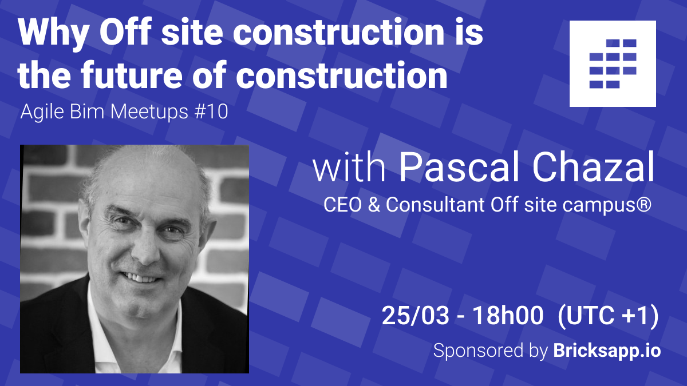

# Why Off site construction is the future of construction #10

👉 [LinkedIn Event page](https://www.linkedin.com/events/6752725838732558336/)

👉 [Meetup Event ](https://www.meetup.com/fr-FR/collaborative-architecture/events/276812998/)

### 📽️ The video on YouTube&#x20;



For this month Agile BIM meetup, Pascal Chazal CEO of Magazine Hors-Site (off site) will give a presentation about off site construction.

He will emphasize how this paradigm shift in construction in linked to the organization changes in the construction industry.

* Why industrialization of construction and off-site is the future of construction
* How to think and design a building with off-site construction in mind
* How off-site can help tackle the challenge of retrofitting old buildings to cut their carbon emissions
* How off-site change the way of collaborating together and has link with agile

### Why off-site construction is important&#x20;

\
Off-site construction is at the crossroad of many themes we talked about last months :\
\* Modularization  & Open-source architecture \
\* Agile teams in construction\
\* Robotization, CNC & Maker movement\
\* AI and generative design\
\* Climate change and carbon zero construction\
\
We will see how this evolution of the construction industry will also probably change the work organization and the methods. Let's get back to agile :)

And more important off-site construction, is a unique trigger to make the construction industry finally more innovative, because of the added rentability to invest in R\&D.\
\
The immediate needs to refurbish thousands of building to make them eco-compatible is also a great field for off-site. \
\
So let's meet at the next meetup. \
\
Don't forget to reserve your seat in the LinkedIn event page [https://www.linkedin.com/events/6760329981437501440/ ](https://www.linkedin.com/events/6760329981437501440/)and get late test news, replay. \
\
Till then, you can subscribe to our YouTube channel [https://www.youtube.com/channel/UCTjcoh157n3hxKCxpEvfqeQ](https://www.youtube.com/channel/UCTjcoh157n3hxKCxpEvfqeQ) to watch previous meetups.


Apprenez la construction hors-site gratuitement sur ce site [https://www.campushors-site.com/](https://www.campushors-site.com/)

