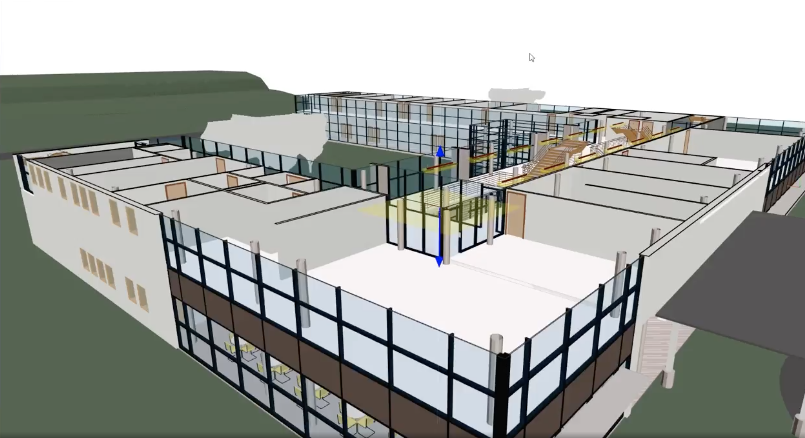

# 🚀 Speckle + IFC.js 
2 open source tools to agilize design #14



**What is there in common between Speckle and IFC.js :**

👉 They are open-source with a strong community behind them&#x20;

👉 They have the potential to revolutionize the design process in AEC&#x20;

👉 They fluidify collaboration and enable agility within the design and construction team

We are happy to receive, for the last agile BIM meetup of the year, the co-founders of these projects.

**They will present you :**

👉 Why open-source is important and game changing to develop such tools&#x20;

👉 What is the pain-point and solution that they bring&#x20;

👉 How they contribute to streamline collaboration and empower agility

### 🧱 Agile BIM 14 Program

### Speckle

✨ <mark style="background-color:yellow;">A shared mission, a common greater good: how Speckle and open source software are transforming our industry and enabling the next generation of BIM.</mark><mark style="color:blue;">** **</mark>✨

💡 **What is Speckle** : Speckle is a cloud based solution for the AEC industry that provides honest interoperability, real time collaboration, data management, versioning and automation.

[https://speckle.systems/](https://speckle.systems)

****[**Matteo Cominetti**](https://www.linkedin.com/in/teocomi/):  Matteo is Co-Founder of Speckle, the open source data platform for the AEC industry. Possessing a multidisciplinary background in architecture, engineering, and software development, he spent the past decade developing modern software solutions for the built environment. Matteo has previously worked at Arup, Foster + Partners, WeWork, and CASE.

****[**Dimitrie Stefanescu**](https://www.linkedin.com/in/dimitrie/)**:** Dimitrie started Speckle as an open source project during his research as a Marie Curie Fellow at UCL. He holds a PhD in Digital Design Communication. Prior to founding the company around Speckle, his career spans the professional boundaries of academia and practice, software development and design. Dimitrie previously worked at Arup, UCL, Bogdan & Van Broeck, TU Berlin, ABK Stuttgart.

### IFC.js

✨ <mark style="background-color:yellow;">IFC.js: opening the doors to the BIM software market.</mark> ✨

[https://ifcjs.github.io/](https://ifcjs.github.io)

💡 **What is IFC.js** : IFC.js is a JavaScript library to load, display and edit IFC models in the browser.

****[**Antonio Viergas**](https://www.linkedin.com/in/antonio-gonz%C3%A1lez-viegas-8b2326151/)**:** One of the many authors of IFC.js. Dedicated and proactive architect with a solid work experience in BIM, development (Typescript, C++, C#) and 3D (Three.js) as well as project management in New York, Germany and Spain. Based in Sevilla.

\
