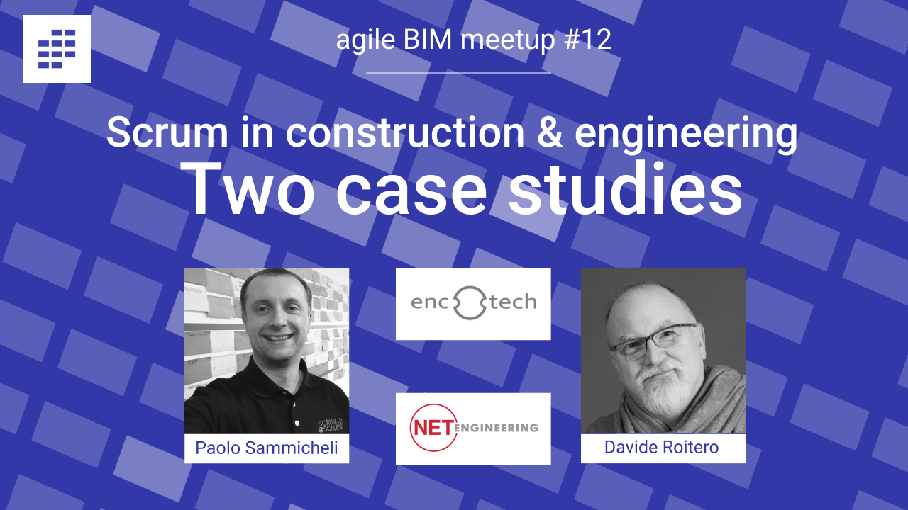
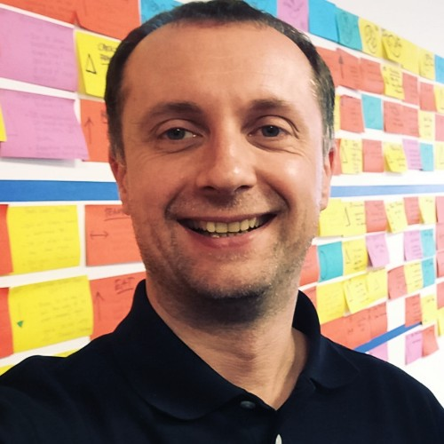
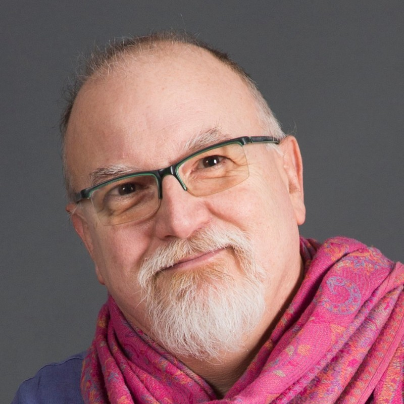
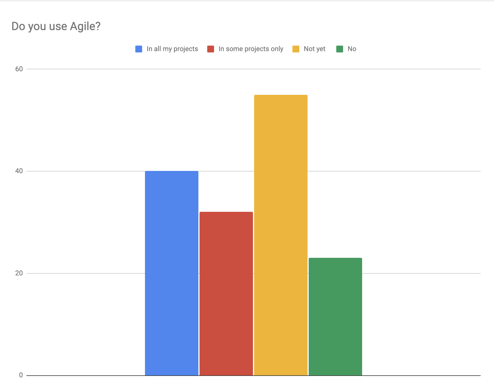
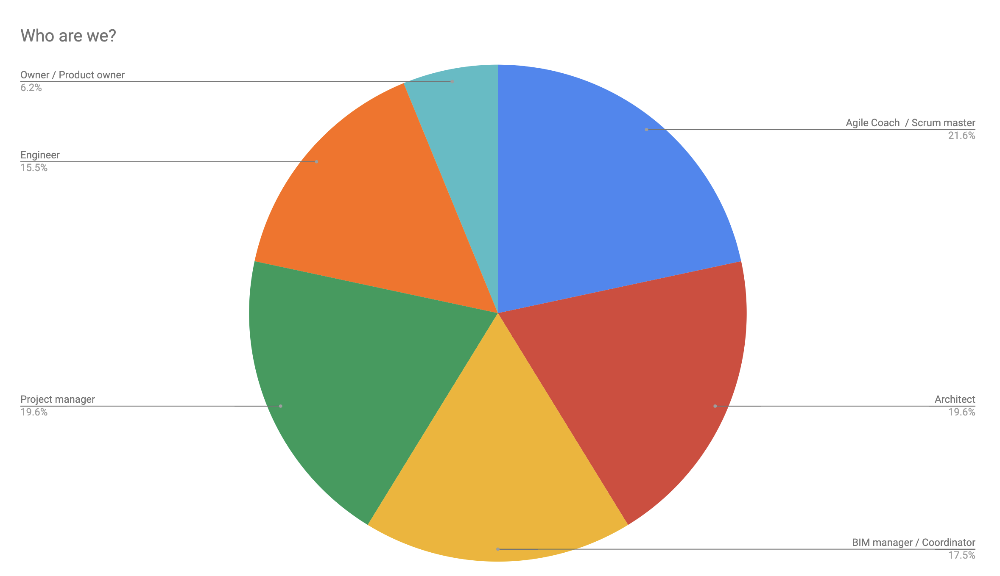
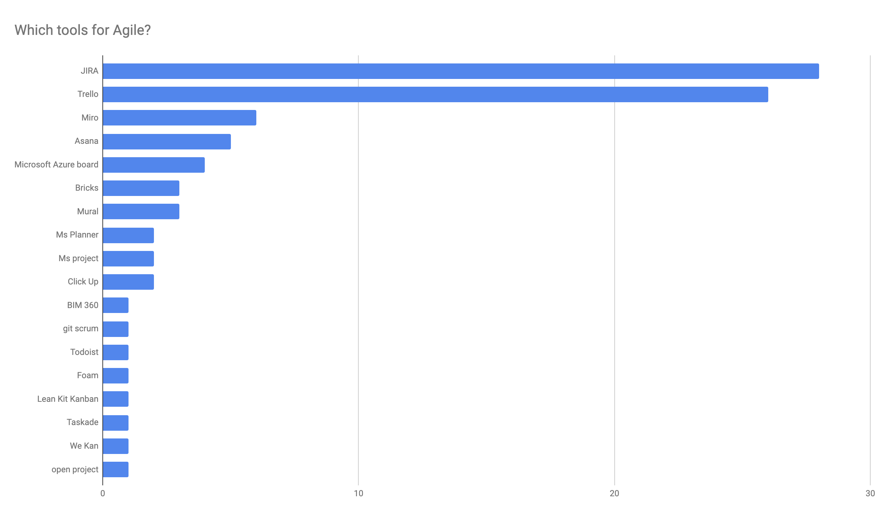

# Scrum for construction & Engineering : 2 case studies  \#12

### REGISTRATION REQUIRED HERE : ✋ [https://lu.ma/zi5ejvt9](https://lu.ma/zi5ejvt9) ✋



### ✨ About the meetup 

When the number of customers increases \(very nice-to-have problem\) and the complexity increases, it is not easy to grow in size while maintaining excellent quality.

We need a global and shared vision of priorities, shared responsibilities, delegation, autonomy, and simple processes with an easy onboarding of new staff.

How to achieve this? Agile and Scrum sound like the solution.

We will see the never-ending journey of TWO engineering and construction companies improving themselves, moving from "resources" assigned to projects to cohesive teams of professionals capable of delighting customers in a coordinated and cross-functional way.

Thanks to understanding clients' needs, clear prioritization, transparency, and continuous improvement, these Firms are using Scrum to express the best of their potential.  

### ✨ About the construction and engineering companies 

👉 [**NET Engineering**](https://www.net-italia.com/en/the-international-group/) is a group of highly esteemed, reputable, and reliable engineering companies strategically located in different national markets and constantly present at the European level, with over 40 years of significant experience. The NET Group has kept its native family-run business approach pumping in its DNA. This is a vital characteristic that distinguishes our approach when compared to those of other large-scale multinational companies. It is only in sitting by a client's side and adopting a flexible, two-pairs-of-hands approach that we can offer suitable, long-term solutions to satisfy every need of our clients and projects' stakeholders.

👉 [**ENCOTECH**](https://www.encotech.ch/en) is a company with Swiss precision and Italian creativity that operates in several areas, from civil engineering to infrastructure, both nationally and internationally.

ENCOTECH took care of small to large projects, both public and private. They work in many areas from the residential to hotel industry, from commercial to industrial or from sport industry to large theaters and museums, and offer a complete, efficient, and modern service of Project Management, Design, Direction of Works and Cost Control. Thanks to its teams, Encotech can handle all construction phases, from the feasibility study to the final testing. 

### ✨ About the 2 speakers

  
👉 [**Paolo Sammicheli** ](https://www.linkedin.com/in/paolosammicheli/)is an Italian entrepreneur with experience of over 30 years who works as an Agile Business Coach specialized in Scrum, Scrum@Scale, Kanban, Lean Startup, and Design Thinking. Scrum Trainer and Scrum@Scale Trainer with Scrum Inc, Lean-Agile Procurement Trainer, and Management 3.0 Facilitator. Author of the books "Scrum for Hardware," "Scrum in AI," and an International Speaker.

👉 [**Davide Luca Roitero**](https://www.linkedin.com/in/davide-luca-roitero-8a3703125/) has an experience of about 40 years in Information Technology and Organization; today is the Agile Transformation Leader of the oldest bank in the world. He also works as an Agile Business Coach for private companies and as a lecturer for the University of Pisa. He is an enthusiast Agilist since 2010 and speaker at various conferences.

### Meetup \# 12 attendance stats 

### Who already use Agile in his projects

### Who are we?

### What tools do we use

