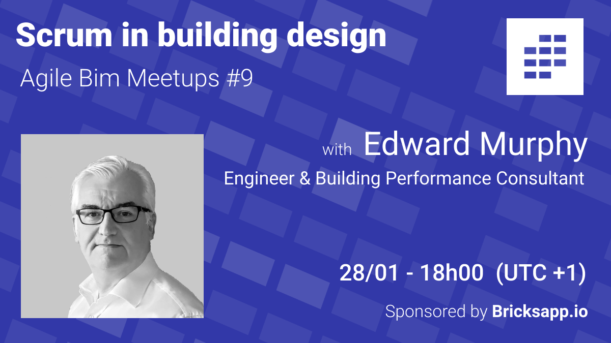
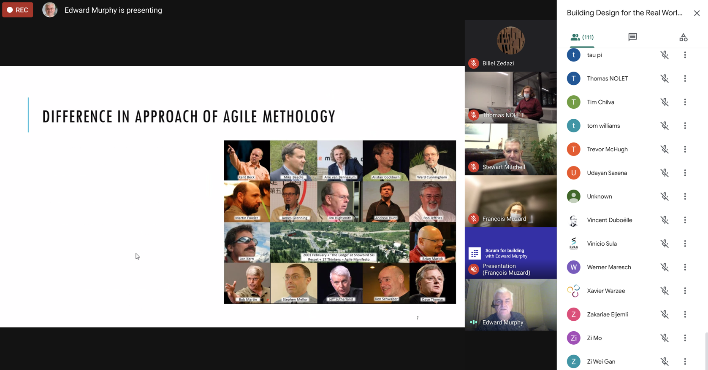
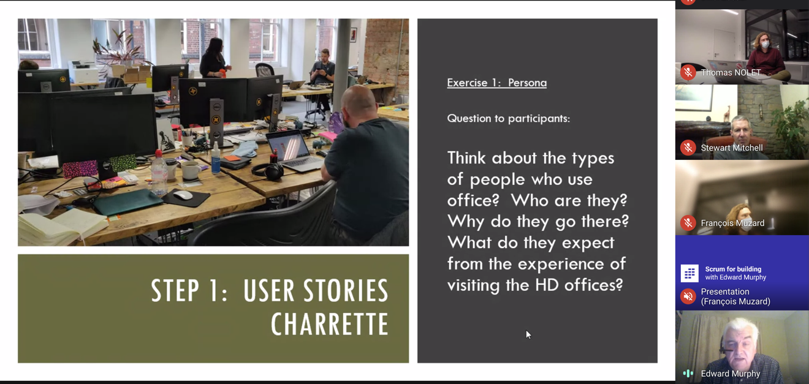
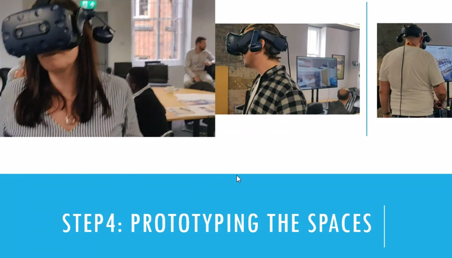

# Agile in building / Hippo digital case study \#9

**Join the event! Next 28/01 at 18h00 \(UTC + 1\)**

👉 [LinkedIn Event page](https://www.linkedin.com/events/6752725838732558336/)

👉 [Meetup Event page](https://www.meetup.com/fr-FR/collaborative-architecture/events/275592382/)

### Scrum for building  / A better design with agile for Hippo digital office workspace by Edward Murphy

### 📽️ The video on YouTube 

Coming soon !  On our [Youtube Channel](https://www.youtube.com/channel/UCTjcoh157n3hxKCxpEvfqeQ?sub_confirmation=1)  


Subcribe to our [Youtube page ](https://www.youtube.com/channel/UCTjcoh157n3hxKCxpEvfqeQ)  
👉 Join our [linkedin page](https://www.linkedin.com/events/6732032311832969216/)  
👉 Join our [meetup group](https://www.meetup.com/fr-FR/collaborative-architecture)  


###  🖼️  Slides of the presentation



### **Whatt about**

👉 **Who is presenting** 

* **Edward Murphy** [Linkedin profile](https://www.linkedin.com/in/edward-murphy-a2349526/) Engineer and building performance consultant 
* **Ollio** [Company page](https://www.ollioconsult.com/) : As building performance specialists our goal is to align the interests of those who develop, design and construct low carbon healthy buildings with those who inhabit them day to day.

👉 **Summary :**   
During this month Agile BIM meetup,  Edward Murphy founder of Ollio,  will give a presentation called "Building Design for the Real World".  Edward has a field experience of using scrum to help the design of buildings more efficient and adapted to the users. He will present a case study of an office workspace originally designed traditionally then redesigned with agile to take into account the teams true needs and desire.   

👉  **Case study : HippoDigital's new office redesign with Agile in Building methologies:**   
  
This case study will outline Ollio experience with applying scrum methodology in the development of the design and client brief for Hippo Digital's new office for 90 office workers.   

### **A disappointed first design**

  
[HippoDigital](https://hippodigital.co.uk/) is an agency composed of UX and Scrum Masters who work in the tech industry. So they are already comfortable with Agile Methods. When they moved into their new office in 2018 they allowed the engaged interior architect to suggest a layout. After 12 months since the project started, they realized the design simply did not work! In 2019, Hippo Digital Director asked Ollio if Agile in Buildings might help arrive at a better interior arrangement for the office teams.   
  

### **A rework using agile in buildings methodologies**

[Agile in Buildings](../en/agile-construction/) is Ollio's adaptive consolidation of Jeff Sutherland and Ken Schweber' Agile [Scrum](https://www.scrumguides.org/docs/scrumguide/v2020/2020-Scrum-Guide-US.pdf) combined with immersive Virtual Reality 3D modelling as a vehicle to involve users. It has been applied in the development of client briefs and early stage concept designs.   
  
In the meetup, Edward will explain how Agile in Buildings works and how to use these's new approaches for brief development and buildings design. 

He took all users from top to bottom through a full [User Stories](../en/agile-toolbox/user-stories.md), [Product Backlog](../en/agile-toolbox/product-backlog.md) and Scrum Team [prototyping](../en/agile-toolbox/rapid-prototyping.md) process to inform how their new office needed to work for everyone. Then rapidly test the emergent design before the whole of the organization collectively agreed on what they should physically build out. 

### **Space design as a way to reorganize the way the team work** 

In what transpired to be a fascinating, elegant, and wholly enjoyable journey, users worked with Ollio partnered architects to transform not just the office interior layouts but the whole way of office team working, becoming recognizably more efficient as an organization.   
  

Thanks for reading and see you at the [next meetups ](https://www.linkedin.com/showcase/agile-bim/)

### A word of our sponsor

This meetup is sponsored  by Bricks, [the agile collaboration app for architecture and construction](https://www.bricksapp.io?utm_medium=agileBIM&utm_campaign=page)

