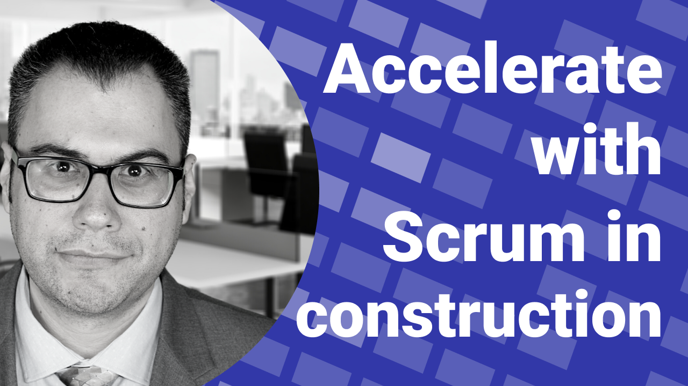
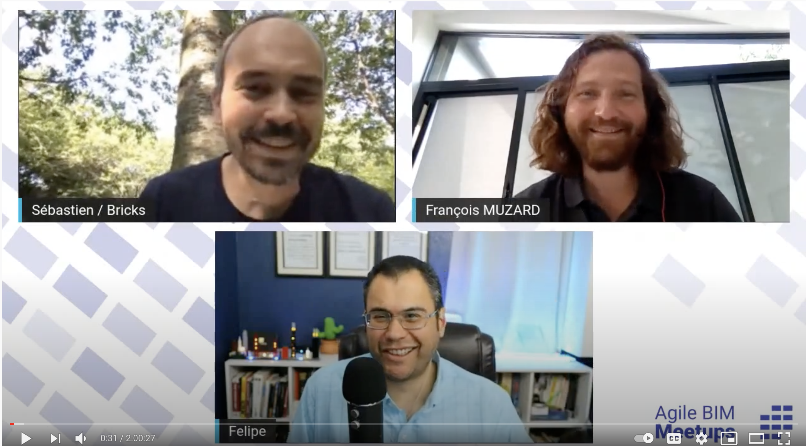
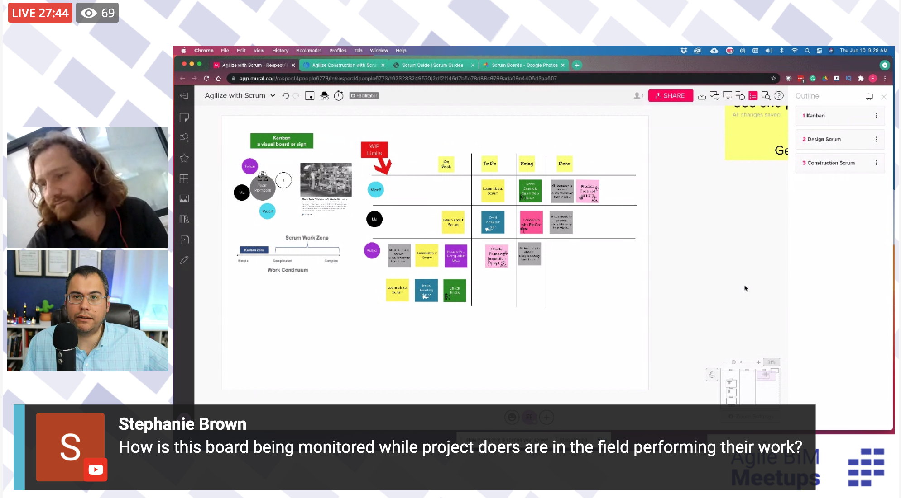

# Accelerate with Scrum for construction \#11

👉 [Registration page](https://lu.ma/30q5281t)

For this month Agile BIM meetup, Felipe Engineer-Manriquez will give a presentation about accelerate with Scrum for construction.

### Connect with Felipe Engineer-Manriquez

* **LinkedIn** at [https://www.linkedin.com/in/engineerfelipe](https://www.linkedin.com/in/engineerfelipe) 
* **Twitter** at [https://twitter.com/felipe\_engineer](https://twitter.com/felipe_engineer)
* **Instagram** at [https://www.instagram.com/thefelipeengineer](https://www.instagram.com/thefelipeengineer) 
* **TikTok** at [https://www.tiktok.com/@felipeengineer](https://www.tiktok.com/@felipeengineer) 
* **Clubhouse** at [https://www.clubhouse.com/@theebfcshow](https://www.clubhouse.com/@theebfcshow) 
* Follow the **EBFC Show** \(Felipe Podcast\) [https://www.theebfcshow.com/contact/](https://www.theebfcshow.com/contact/)

### **About Felipe Engineer-Manriquez**

A serial intrapreneur, Felipe Engineer-Manriquez is an International Lean speaker and practitioner with over two decades of experience in process improvement, project planning and execution, change management, and employee engagement in the construction industry. Over the past ten years, he also helped organizations implement Agile business strategies. Engineer-Manriquez is a Jeff Sutherland Certified ScrumMaster® and Scrum Trainer by Scrum Inc.™ in addition to being a Product Owner by Scrum Inc.™ and Certified Scrum@Scale Practitioner™.

### Event Information

​Are you ready to make your work exponentially easier and valuable for your organization ? Learn when to use simple Kanban and when to use Scrum to harness the power of one-piece flow. Double your productivity using this framework with less effort. Workshop resources will be provided to guide scaling up to fully functional Scrum teams. Felipe will be LIVE to answer any of your questions around better ways of using Agile mindsets or anything else that’s on your mind.

### 📽️ The video on YouTube 



### 🖼️ Some pics of the meetups 

