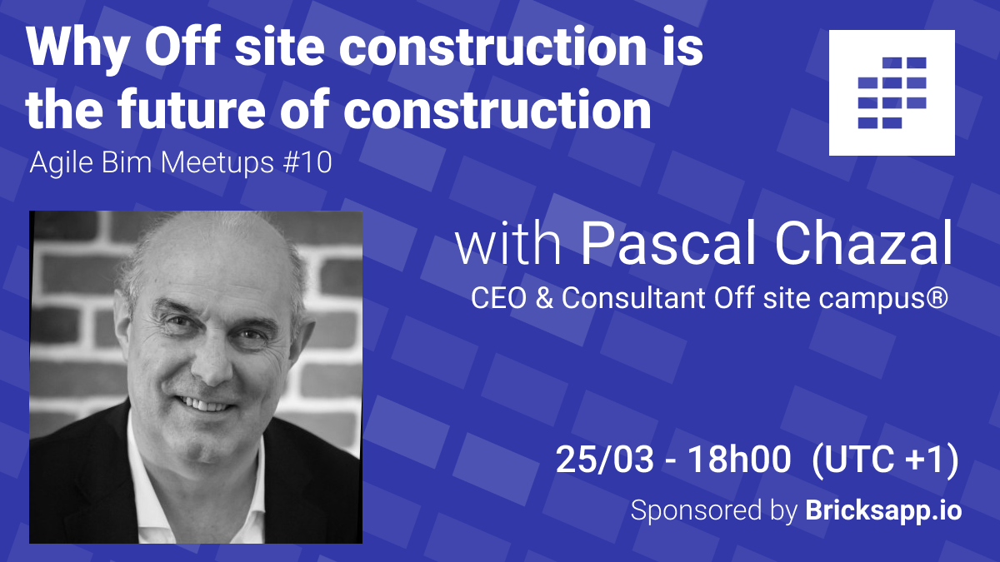

# Why Off site construction is the future of construction \#10

**Join the event! Next 25/03 at 18h00 \(UTC + 1\)**

👉 [LinkedIn Event page](https://www.linkedin.com/events/6752725838732558336/)

👉 [Meetup Event ](https://www.meetup.com/fr-FR/collaborative-architecture/events/276812998/)

For this month Agile BIM meetup, Pascal Chazal CEO of Magazine Hors-Site \(off site\) will give a presentation about off site construction.

He will emphasize how this paradigm shift in construction in linked to the organization changes in the construction industry.

* Why industrialisation of construction and off-site is the future of construction
* How to think and design a building with off-site construction in mind
* How off-site can help tackle the challenge of retrofitting old buildings to cut their carbon emissions
* How off-site change the way of collaborating together and has link with agile

