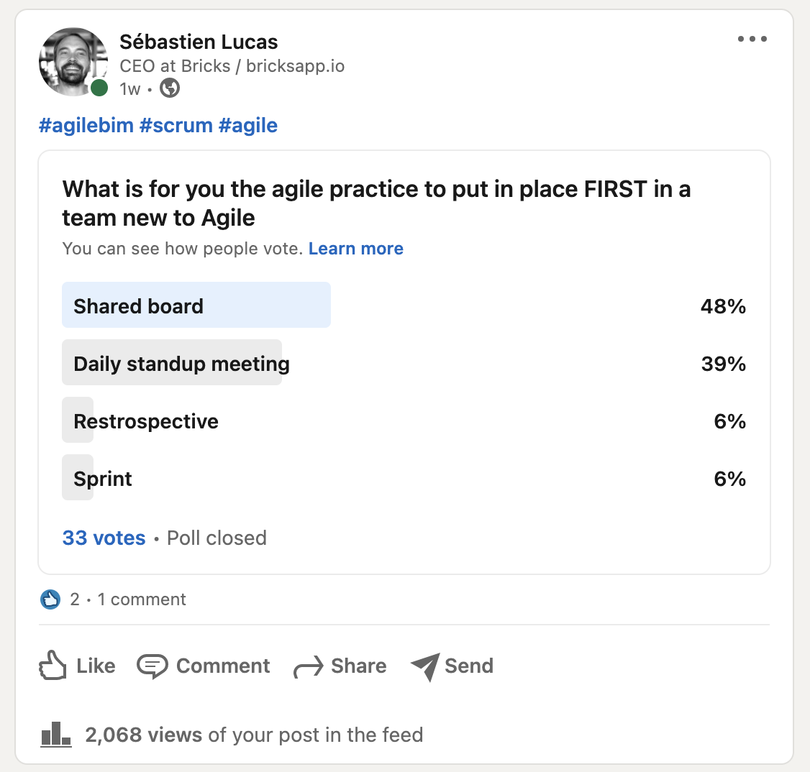

# 🏁 Start Agile in your company

### What [agile practice](learn-and-practice-agile-bim/agile-tools.md) needs to be set up first? 

[https://www.linkedin.com/posts/archiref\_agilebim-scrum-agile-activity-6821352907380809728-IY9F](https://www.linkedin.com/posts/archiref_agilebim-scrum-agile-activity-6821352907380809728-IY9F)

Suggestion by [Felipe Engineer ](https://www.linkedin.com/in/engineerfelipe/)

> Other: Commitment Many people talk about Agile practices and fewer adopt them. Find the curious people. They are easy to spot in any organization. They are the ones that look up when you meet them.

