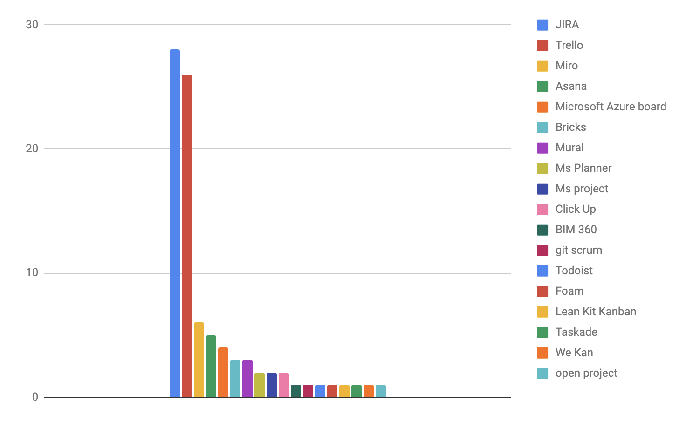

# 🏁 Start Agile in your company

## What to do to setup Agile practices progressively&#x20;

* Identify the interested people in the company who can drive the change&#x20;
* Define some starter agile practice to test&#x20;
  * Set up a **shared board **so that all people in the company can view the coming action
    * Decide between a physical board or virtual or both&#x20;
    * If you've chosen virtual, [choose an app](learn-and-practice-agile-bim/agile-tools.md) to make it easy to share the board distantly
  * Define a schedule for r**egular coordination meeting** : [Standup meeting](en/agile-practices/standup-meeting.md)
  * Choose if you want to have regular schedule (**Scrum**) or continuous handling of tasks (**kanban**). To decide, ask your team if the tasks they are working on are predictable or not (can you have unexpected tasks to work on during the week). If they are predictable, scrum maybe for you, if not kanban is better
  * Define a schedule to show the project internally to **get feedbacks** from others (Read more on [demo the project](en/agile-practices/project-demo.md))&#x20;
  * Define a schedule to talk with the team to understand what is going well, not so well... and to take time to think how we can improve our selves what is called [retrospectives](en/agile-practices/restrospective.md)
* Choose a starter project that is not too big, not too complex, and with a small team 3-5 is ideal
* Test, adapt and iterate

## What the community think?

### What [agile practice](learn-and-practice-agile-bim/agile-tools.md) needs to be set up first?&#x20;

[https://www.linkedin.com/posts/archiref\_agilebim-scrum-agile-activity-6821352907380809728-IY9F](https://www.linkedin.com/posts/archiref\_agilebim-scrum-agile-activity-6821352907380809728-IY9F)

Suggestion by [Felipe Engineer ](https://www.linkedin.com/in/engineerfelipe/)

> Other: Commitment Many people talk about Agile practices and fewer adopt them. Find the curious people. They are easy to spot in any organization. They are the ones that look up when you meet them.

### Which tools do agile BIM community users like&#x20;

These stats come from the attendance of last [Agile BIM meetup](meetups/scrum-construction-enginery-meetup.md)&#x20;

